# DeepDive Lab

### Scenario
You have given a memory image for a compromised machine. As a security blue team analyst Analyze the image and figure out attack details.

Resource: https://www.geoffchappell.com/studies/windows/km/ntoskrnl/api/ob/inc/header/infomask.htm

### Tool

- Volatility 2

- Virustotal

### Solution

#### Question 1: What profile should you use for this memory sample?

I will use plugin `imageinfo` of Volatility to check it.

```bash
┌──(kali㉿kali)-[~/Desktop/workspace/temp_extract_dir]
└─$ python2 ~/Desktop/Tools/volatility/vol.py -f banking-malware.vmem imageinfo                                                
Volatility Foundation Volatility Framework 2.6.1
INFO    : volatility.debug    : Determining profile based on KDBG search...
          Suggested Profile(s) : Win7SP1x64, Win7SP0x64, Win2008R2SP0x64, Win2008R2SP1x64_24000, Win2008R2SP1x64_23418, Win2008R2SP1x64, Win7SP1x64_24000, Win7SP1x64_23418
                     AS Layer1 : WindowsAMD64PagedMemory (Kernel AS)
                     AS Layer2 : FileAddressSpace (/home/kali/Desktop/workspace/temp_extract_dir/banking-malware.vmem)
                      PAE type : No PAE
                           DTB : 0x187000L
                          KDBG : 0xf80002bef120L
          Number of Processors : 1
     Image Type (Service Pack) : 1
                KPCR for CPU 0 : 0xfffff80002bf1000L
             KUSER_SHARED_DATA : 0xfffff78000000000L
           Image date and time : 2021-02-09 00:51:25 UTC+0000
     Image local date and time : 2021-02-08 22:51:25 -0200
```

#### Question 2: What is the KDBG virtual address of the memory sample?

The result also found in the output of `imageinfo`

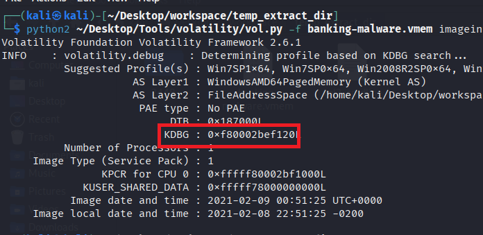

#### Question 3: There is a malicious process running, but it's hidden. What's its name?

To check the hidden process, we can use the plugin `psxview`

```bash
python2 ~/Desktop/Tools/volatility/vol.py -f banking-malware.vmem --profile=Win7SP1x64 psxview 
```

We see that there is a process which not appear on pslist or psscan

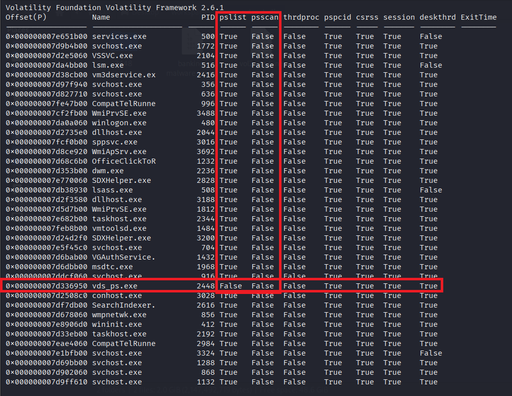

#### Question 4: What is the physical offset of the malicious process?

Easy to see that, it's `0x000000007d336950`

#### Question 5: What is the full path (including executable name) of the hidden executable?

I will use `cmdline` plugin to find that. Note that we cannot use pid to trace the process because maybe the malware uses some technique that makes us cannot find it normally or find it in pslist. Instead, I will use **offset**.

```bash
┌──(kali㉿kali)-[~/Desktop/workspace/temp_extract_dir]
└─$ python2 ~/Desktop/Tools/volatility/vol.py -f banking-malware.vmem --profile=Win7SP1x64 cmdline --offset=0x000000007d336950
Volatility Foundation Volatility Framework 2.6.1
************************************************************************
vds_ps.exe pid:   2448
Command line : "C:\Users\john\AppData\Local\api-ms-win-service-management-l2-1-0\vds_ps.exe"
```

#### Question 6: Which malware is this?

To find what malware this is, I will check the malware on Virustotal. Before that, I dumped the process to find the malware file and get the hash value.

```bash
python2 ~/Desktop/Tools/volatility/vol.py -f banking-malware.vmem --profile=Win7SP1x64 procdump --offset=OFFSET0x000000007d336950 --dump-dir=2448/

┌──(kali㉿kali)-[~/Desktop/workspace/temp_extract_dir]
└─$ cd 2448          
                                                                                                                                                                                                                  
┌──(kali㉿kali)-[~/Desktop/workspace/temp_extract_dir/2448]
└─$ ls
executable.2448.exe
                                                                                                                                                                                                                  
┌──(kali㉿kali)-[~/Desktop/workspace/temp_extract_dir/2448]
└─$ sha256sum executable.2448.exe
c5c5e5f6da7ec82875410b971b3f02f09e35fc25fe714441347753d1b7b656ea  executable.2448.exe
```

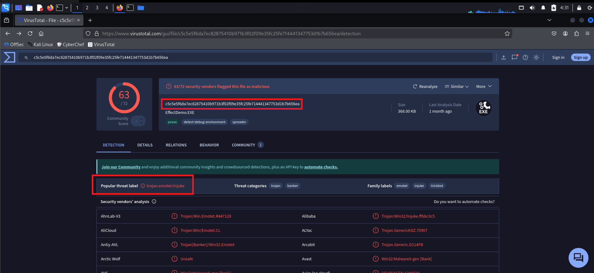

#### Question 7: The malicious process had two PEs injected into its memory. What's the size in bytes of the Vad that contains the largest injected PE? Answer in hex, like: 0xABC

To find the size of the injected memory area, we must first find the injected memory area => get information about the corresponding VAD

I used plugin `malfind` to find it

```
┌──(kali㉿kali)-[~/Desktop/workspace/temp_extract_dir]
└─$ python2 ~/Desktop/Tools/volatility/vol.py -f banking-malware.vmem --profile=Win7SP1x64 malfind --offset=0x000000007d336950 | grep -i 'address'
Volatility Foundation Volatility Framework 2.6.1
Process: vds_ps.exe Pid: 2448 Address: 0x220000
Process: vds_ps.exe Pid: 2448 Address: 0x2a10000
Process: vds_ps.exe Pid: 2448 Address: 0x2a80000
```

We see that, there are 3 injected memory area, we use `vadinfo` to get information about the corresponding VAD

```bash
python2 ~/Desktop/Tools/volatility/vol.py -f banking-malware.vmem --profile=Win7SP1x64 vadinfo --offset=0x000000007d336950 -a <address>
```

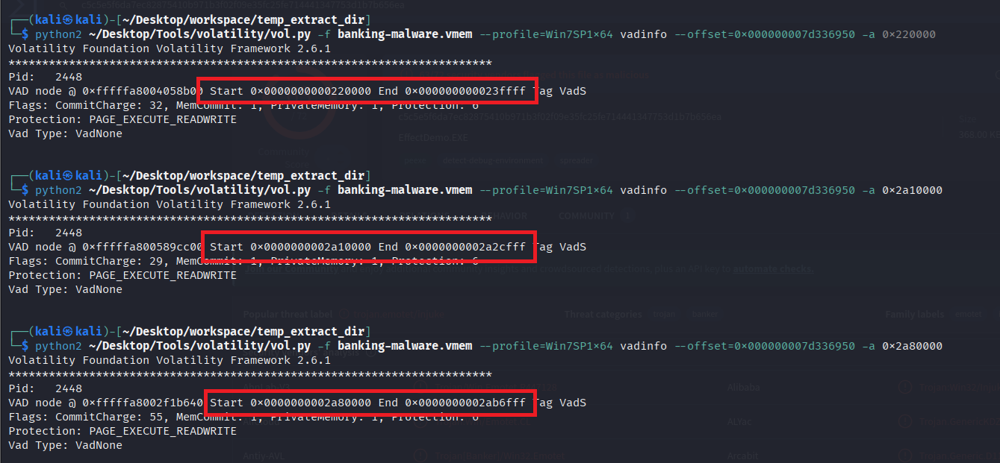

Calculation time ! ~~ We will take (the END value - the START value)

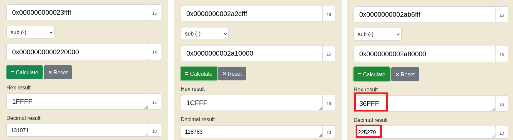

#### Question 8: This process was unlinked from the ActiveProcessLinks list. Follow its forward link. Which process does it lead to? Answer with its name and extension

To do this, I sort the psxview by the pid first.

```bash
python2 ~/Desktop/Tools/volatility/vol.py -f banking-malware.vmem --profile=Win7SP1x64 psxview > psxview.txt

cat psxview.txt | awk '{print $3, $0}' | sort -n | cut -d' ' -f2- 
```

After sorted, we have:

```
------------------ -------------------- ------ ------ ------ -------- ------ ----- ------- -------- --------
Offset(P)          Name                    PID pslist psscan thrdproc pspcid csrss session deskthrd ExitTime
0x000000007ffad860 System                    4 True   False  False    True   False False   False    
0x000000007ee7d6c0 smss.exe                272 True   False  False    True   False False   False    
0x000000007d97f940 svchost.exe             356 True   False  False    True   True  True    True     
0x000000007dde39a0 csrss.exe               360 True   False  False    True   False True    True     
0x000000007e8906d0 wininit.exe             412 True   False  False    True   True  True    True     
0x000000007e9c6060 csrss.exe               424 True   False  False    True   False True    True     
0x000000007da0a060 winlogon.exe            480 True   False  False    True   True  True    True     
0x000000007e651b00 services.exe            500 True   False  False    True   True  True    False    
0x000000007db38930 lsass.exe               508 True   False  False    True   True  True    False    
0x000000007da4bb00 lsm.exe                 516 True   False  False    True   True  True    False    
0x000000007d827710 svchost.exe             636 True   False  False    True   True  True    True     
0x000000007e5f45c0 svchost.exe             704 True   False  False    True   True  True    True     
0x000000007d8a7b00 svchost.exe             756 True   False  False    True   True  True    True     
0x000000007d678060 wmpnetwk.exe            856 True   False  False    True   True  True    True     
0x000000007d902060 svchost.exe             868 True   False  False    True   True  True    True     
0x000000007ddcf060 svchost.exe             916 True   False  False    True   True  True    True     
0x000000007ddc4060 svchost.exe             960 True   False  False    True   True  True    True     
0x000000007fe47b00 CompatTelRunne          996 True   False  False    True   True  True    True     
0x000000007d929370 audiodg.exe            1008 True   False  False    True   True  True    True     
0x000000007d989b00 spoolsv.exe            1096 True   False  False    True   True  True    True     
0x000000007d9ff610 svchost.exe            1132 True   False  False    True   True  True    True     
0x000000007d68c6b0 OfficeClickToR         1232 True   False  False    True   True  True    True     
0x000000007d69bb00 svchost.exe            1288 True   False  False    True   True  True    True     
0x000000007d6bab00 VGAuthService.         1432 True   False  False    True   True  True    True     
0x000000007feb8b00 vmtoolsd.exe           1484 True   False  False    True   True  True    True     
0x000000007d9b4b00 svchost.exe            1772 True   False  False    True   True  True    True     
0x000000007d5d7b00 WmiPrvSE.exe           1812 True   False  False    True   True  True    True     
0x000000007d203930 dllhost.exe            1832 True   False  False    True   True  True    True     
0x000000007d6dbb00 msdtc.exe              1968 True   False  False    True   True  True    True     
0x000000007d2735e0 dllhost.exe            2044 True   False  False    True   True  True    True     
0x000000007d2e5060 VSSVC.exe              2104 True   False  False    True   True  True    True     
0x000000007d33eb00 taskhost.exe           2192 True   False  False    True   True  True    True     
0x000000007d353b00 dwm.exe                2236 True   False  False    True   True  True    True     
0x000000007d3535a0 taskeng.exe            2244 True   False  False    True   True  True    True     
0x000000007d35db00 explorer.exe           2260 True   False  False    True   True  True    True     
0x000000007e682b00 taskhost.exe           2344 True   False  False    True   True  True    True     
0x000000007d38cb00 vm3dservice.exe        2416 True   False  False    True   True  True    True     
0x000000007d3fc3e0 vmtoolsd.exe           2424 True   False  False    True   True  True    True     
0x000000007d336950 vds_ps.exe             2448 False  False  False    True   True  True    True     
0x000000007df7db00 SearchIndexer.exe      2616 True   False  False    True   True  True    True     
0x000000007e462b00 CompatTelRunne         2688 True   False  False    True   True  True    True     
0x000000007e770060 SDXHelper.exe          2828 True   False  False    True   True  True    True     
0x000000007eae4060 CompatTelRunne         2984 True   False  False    True   True  True    True     
0x000000007fcf0b00 sppsvc.exe             3016 True   False  False    True   True  True    True     
0x000000007d2508c0 conhost.exe            3028 True   False  False    True   True  True    True     
0x000000007db26b00 svchost.exe            3084 True   False  False    True   True  True    True     
0x000000007d2f3580 dllhost.exe            3188 True   False  False    True   True  True    True     
0x000000007d24da30 SDXHelper.exe          3196 True   False  False    True   True  True    True     
0x000000007d24d2f0 SDXHelper.exe          3200 True   False  False    True   True  True    True     
0x000000007e1bfb00 svchost.exe            3324 True   False  False    True   True  True    False    
0x000000007cf2fb00 WmiPrvSE.exe           3488 True   False  False    True   True  True    True     
0x000000007d8ce920 WmiApSrv.exe           3692 True   False  False    True   True  True    True     
0x000000007fc46b00 cmd.exe                3732 True   False  False    True   False True    False    2021-02-09 00:51:25 UTC+0000
0x000000007fc52060 conhost.exe            3848 True   False  False    True   False True    False    2021-02-09 00:51:25 UTC+0000
0x000000007fd4a6e0 ipconfig.exe           4008 True   False  False    True   False True    False    2021-02-09 00:51:25 UTC+0000
```

After malicious process `vds_ps.exe`, it's `SearchIndexer.exe`. However, the process `vds_ps.exe` is unlinked because we see in the psxview: 
`0x000000007d336950 vds_ps.exe  2448  False False True`

Process `vds_ps.exe` has 2 **False** value in pslist and psscan column → this process is no longer in the ActiveProcessLinks list (maybe hidden by DKOM)

Because the PID value increases with each process created, so the flow is look like this: `vmtoolsd.exe` → `vds_ps.exe` → `SearchIndexer.exe`. But `vds_ps.exe` is unlinked, so `vmtoolsd.exe` now has a direct Flink to `SearchIndexer.exe`.

#### Question 9: What is the pooltag of the malicious process in ascii? (HINT: use volshell)

`pooltag` is located in `POOL_HEADER` and we have the layout of *Windows kernel pool allocation**

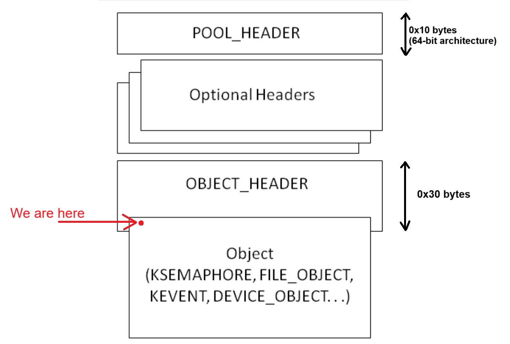

Because we only have the address of EPROCESS (<malware_physical_address>) but not the address of `_POOL_HEADER` so we will calculate the address based on EPROCESS

We want to "touch" the `_POOL_HEADER` we have to find the correct offset: **0x000000007d336950 - 0x30(size of OBJECT_HEADER) - (Size of Optional header) - 0x10(Size of POOL_HEADER 64-bit)**

We have to find the **(Size of Optional header)**. The optional headers will depend on the InfoMask, so we check it first.

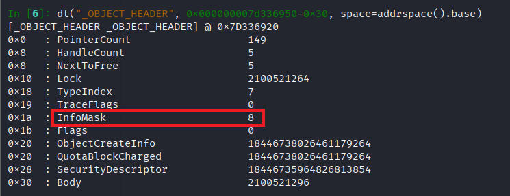

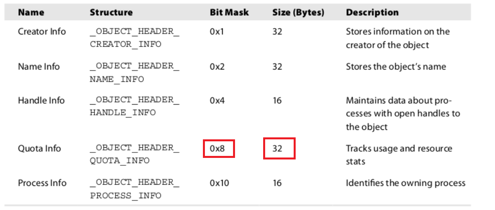

So we only have `_OBJECT_HEADER_QUOTA_INFO` with size of 32 bytes = 0x20 bytes

We have correct offset of `POOL_HEADER`: **0x000000007d336950 - 0x30 - 0x20 - 0x10**

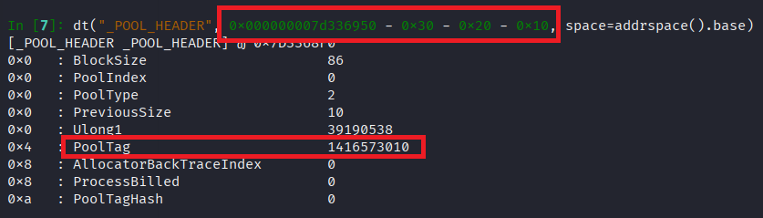

And we convert it to ASCII string

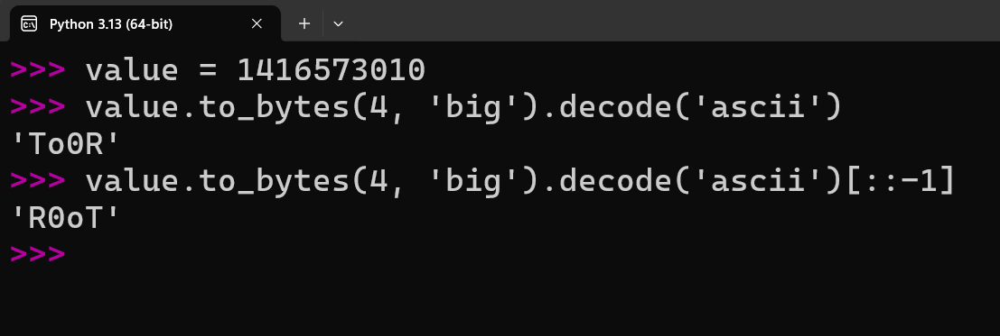

#### Question 10: What is the physical address of the hidden executable's pooltag? (HINT: use volshell)

We see that the size from `_POOL_HEADER` to `PoolTag` is 0x4 bytes, add 0x04 bytes more and we have the correct answer

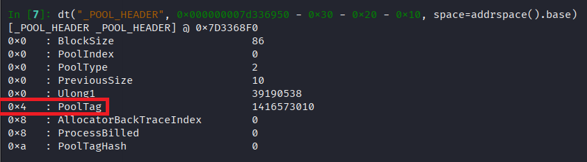

→ `0x000000007d336950 - 0x30 - 0x20 - 0x10 + 0x04 = 0x7D3368F4`

### Final Answer

| Question | Answer |
|----|----|
| Question 1 | `Win7SP1x64` | 
| Question 2 | `0xf80002bef120` | 
| Question 3 | `vds_ps.exe` |
| Question 4 | `0x000000007d336950` |
| Question 5 | `C:\Users\john\AppData\Local\api-ms-win-service-management-l2-1-0\vds_ps.exe`|
| Question 6 | `emotet` | 
| Question 7 | `0x36FFF` | 
| Question 8 | `SearchIndexer.exe` | 
| Question 9 | `R0oT` | 
| Question 10 | `0x7d3368f4` |