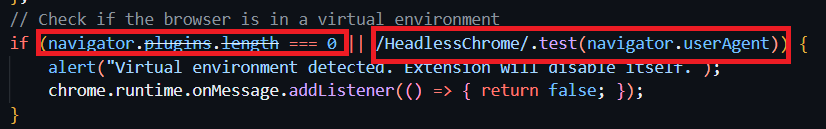
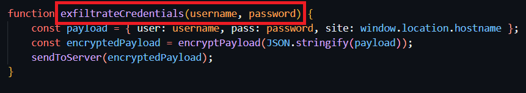

# FakeGPT Lab

### Link: https://cyberdefenders.org/blueteam-ctf-challenges/fakegpt/

### Scenario

Your cybersecurity team has been alerted to suspicious activity on your organization's network. Several employees reported unusual behavior in their browsers after installing what they believed to be a helpful browser extension named "ChatGPT". However, strange things started happening: accounts were being compromised, and sensitive information appeared to be leaking.

Your task is to perform a thorough analysis of this extension identify its malicious components.

### Solution

#### Question 1: Which encoding method does the browser extension use to obscure target URLs, making them more difficult to detect during analysis?

In the `app.js` file, the targets array contains the Base64 encoded string `d3d3LmZhY2Vib29rLmNvbQ==`, which decodes to `www.facebook.com`
Additionally, the _0x5eaf function employs the btoa() method to encode data in Base64, confirming this as the obfuscation technique used.

#### Question 2: Which website does the extension monitor for data theft, targeting user accounts to steal sensitive information?

As mentioned from the previous question, the Base64 encoded string `d3d3LmZhY2Vib29rLmNvbQ==` decodes to `www.facebook.com`

#### Question 3: Which type of HTML element is utilized by the extension to send stolen data?

We will focus on `sendToServer()` function. The stolen data is exfiltrated using an `` element. The src attribute of the `` is set to `https://Mo.Elshaheedy.com/collect?data=` followed by the encrypted payload

#### Question 4: What is the first specific condition in the code that triggers the extension to deactivate itself?

In the file `loader.js`, we will see how the malware employs anti-malware technique. It checks whether `navigator.plugins.length === 0` or in `navigator.userAgent` contain `HeadlessChrome` or not.

#### Question 5: Which event does the extension capture to track user input submitted through forms?

The event `submit` is captured using `document.addEventListener('submit')`. When it's submitted, the `FormData` will extracts the form data and use it for `exfiltrateCredentials()` function.

#### Question 6: Which API or method does the extension use to capture and monitor user keystrokes?

The event `keydown` is captured using `addEventListener('keydown', function(event){`. It controls keystroke in real-time. The log of keystrokes will be sent to the server by `exfiltrateData()` function

#### Question 7: What is the domain where the extension transmits the exfiltrated data?

We will see the answer in `sendToServer()`

#### Question 8: Which function in the code is used to exfiltrate user credentials, including the username and password?

We see that in `exfiltrateCredentials()` function, the payload takes the `username` and `password` from form data. After that, encrypt it and send to the server by `sendToServer()` function

#### Question 9: Which encryption algorithm is applied to secure the data before sending?

We will see the answer in `crypto.js` file. We will see the encrypt function flow:

- key: `SuperSecretKey123`
- iv: random 16 bytes 
- Encrypt using **AES** with these key and iv
- return the encode base64 of output of encryption

#### Question 10: What does the extension access to store or manipulate session-related data and authentication information?

We will find the answer in `manifest.json`. Cookies often store the session tokens so it's a target of attackers. `manifest.json` has permission to access to `cookies` API. This access allows attackers to hijack user sessions or retrieve authentication tokens.

### Final Answer

| Question | Answer |
|---|----|
| Question 1 | `base64` | 
| Question 2 | `www.facebook.com` | 
| Question 3 | `` |
| Question 4 | `navigator.plugins.length === 0` |
| Question 5 | `submit`|
| Question 6 | `keydown` |
| Question 7 | `Mo.Elshaheedy.com` |
| Question 8 | `exfiltrateCredentials(username, password);` |
| Question 9 | `AES` |
| Question 10 | `cookies` |