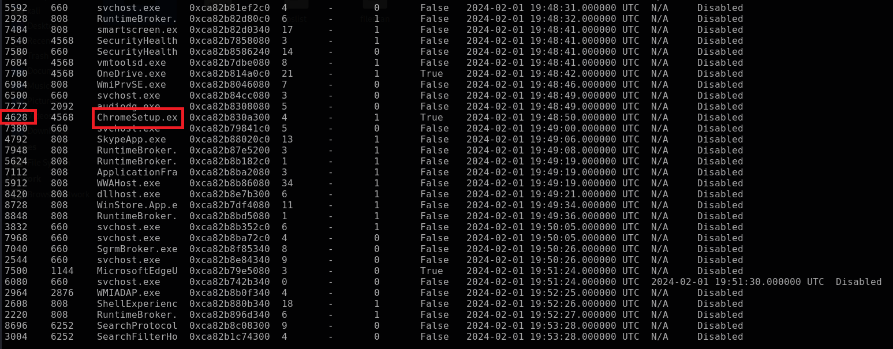
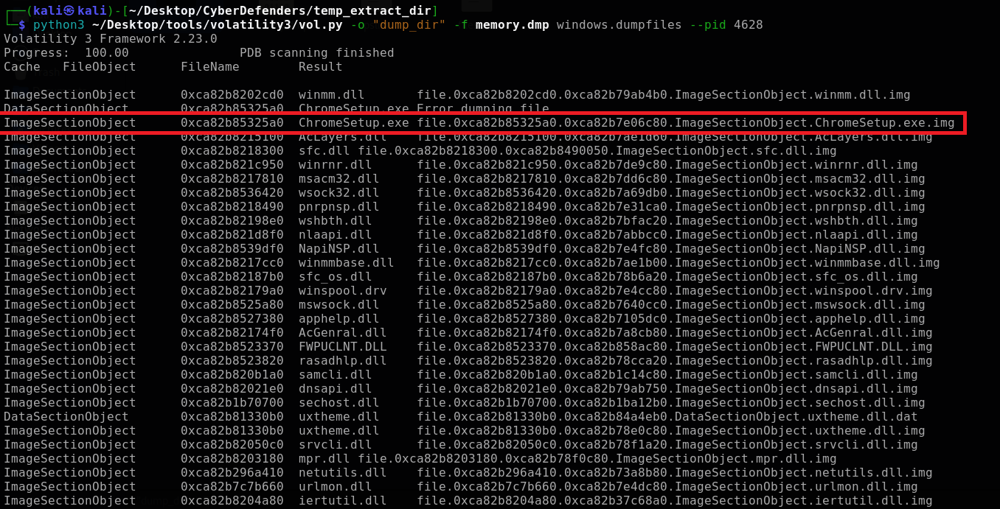
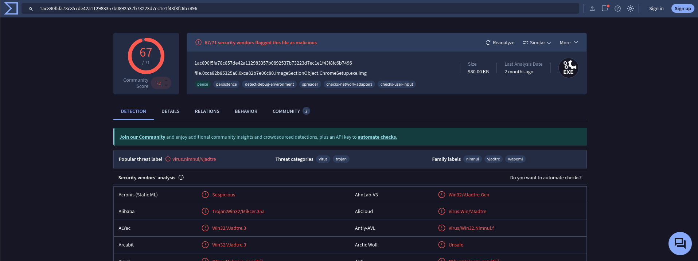
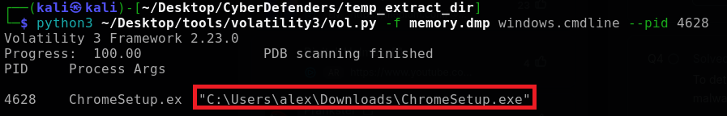
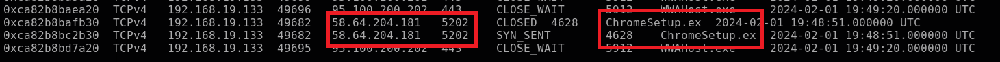
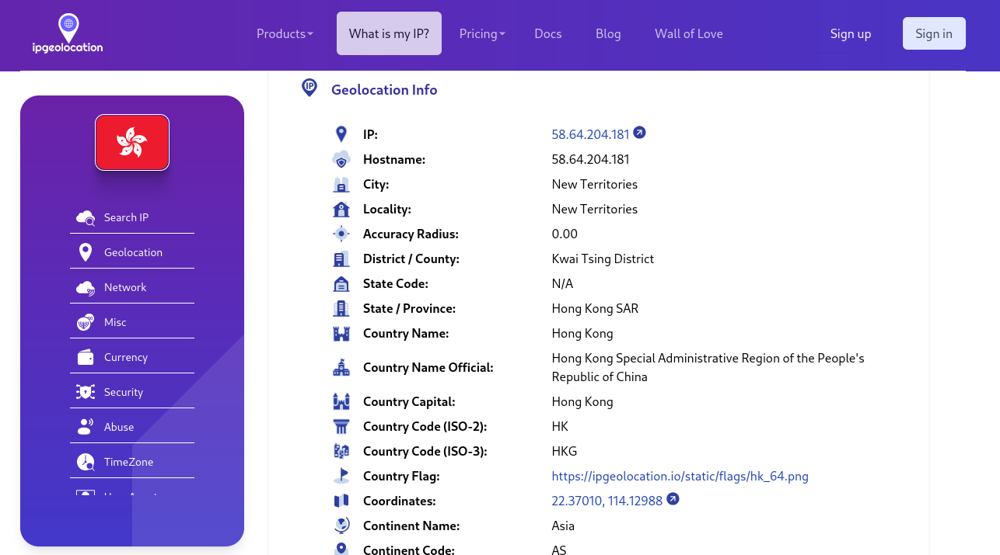
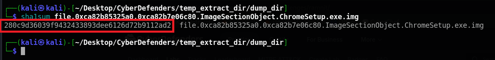
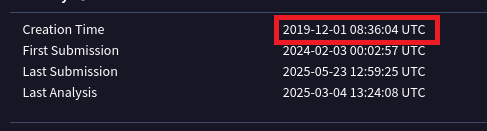
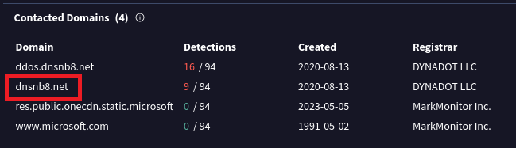

# Ramnit Lab

### Scenario

Our intrusion detection system has alerted us to suspicious behavior on a workstation, pointing to a likely malware intrusion. A memory dump of this system has been taken for analysis. Your task is to analyze this dump, trace the malware’s actions, and report key findings.

### Tool

- Virustotal

- Volatility

- IpGeo

### Solution

#### Question 1: What is the name of the process responsible for the suspicious activity?
We have to find the suspicious activity so I use `pslist` to show the processes.



All is normal, however there is a setup process: `ChromeSetup.exe`

To define if there is suspicious or not, I will dump all related file in that process and check the `.exe` file.

```bash
python3 ~/Desktop/tools/volatility3/vol.py -o "dump_dir" -f memory.dmp windows.dumpfiles --pid 4628
```



I will check it on Virustotal



Well, it's suspicious activity

#### Question 2: What is the exact path of the executable for the malicious process?

To determine the exact path, I used:

```bash
python3 ~/Desktop/tools/volatility3/vol.py -f memory.dmp windows.cmdline --pid 4628
```



#### Question 3: Identifying network connections is crucial for understanding the malware's communication strategy. What IP address did the malware attempt to connect to?

To find IP address did the malware attempt to connect to, I use `netscan` to check it

```bash
python3 ~/Desktop/tools/volatility3/vol.py -f memory.dmp windows.netscan
```



#### Question 4: To determine the specific geographical origin of the attack, Which city is associated with the IP address the malware communicated with?



#### Question 5: Hashes serve as unique identifiers for files, assisting in the detection of similar threats across different machines. What is the SHA1 hash of the malware executable?

```bash
sha1sum file.0xca82b85325a0.0xca82b7e06c80.ImageSectionObject.ChromeSetup.exe.img
```



#### Question 6: Examining the malware's development timeline can provide insights into its deployment. What is the compilation timestamp for the malware?

I checked in VirusTotal (Tab "Details")



#### Question 7: Identifying the domains associated with this malware is crucial for blocking future malicious communications and detecting any ongoing interactions with those domains within our network. Can you provide the domain connected to the malware?

I checked in VirusTotal (Tab "Relations")



### Final Answer

| Question | Answer |
|---|----|
| Question 1 | `ChromeSetup.exe` | 
| Question 2 | `C:\Users\alex\Downloads\ChromeSetup.exe` | 
| Question 3 | `58.64.204.181` |
| Question 4 | `Hong Kong` |
| Question 5 | `280c9d36039f9432433893dee6126d72b9112ad2`|
| Question 6 | `2019-12-01 08:36` |
| Question 7 | `dnsnb8.net` |


