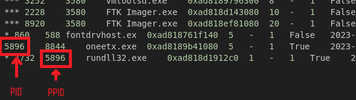
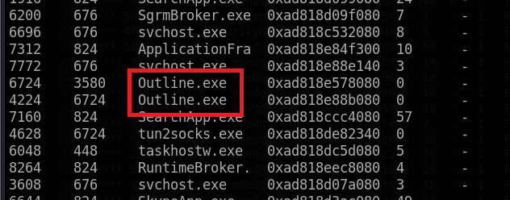

# RedLine Lab

### Scenario

As a member of the Security Blue team, your assignment is to analyze a memory dump using Redline and Volatility tools. Your goal is to trace the steps taken by the attacker on the compromised machine and determine how they managed to bypass the Network Intrusion Detection System (NIDS). Your investigation will identify the specific malware family employed in the attack and its characteristics. Additionally, your task is to identify and mitigate any traces or footprints left by the attacker.

### Tool

- Volatility

- `strings`

### Solution

#### Question 1: What is the name of the suspicious process?

I use `pstree` plugin to find the suspicious process. Usually, suspicious processes originate from user directories/temp or sth.

```bash
python3 ~/Desktop/tools/volatility3/vol.py -f MemoryDump.mem windows.pstree
```


#### Question 2: What is the child process name of the suspicious process?

We want to find child process of suspicious process, which mean we have to find the process has the PPID == PID of suspicious process



#### Question 3: What is the memory protection applied to the suspicious process memory region?

I use `malfind` plugin to find it.

```bash
python3 ~/Desktop/tools/volatility3/vol.py -f MemoryDump.mem windows.malfind
```


#### Question 4: What is the name of the process responsible for the VPN connection?

First of all, I check the `pslist` to find process relate to network connection or sth else

```bash
python3 ~/Desktop/tools/volatility3/vol.py -f MemoryDump.mem windows.pslist
```

I saw that there is a process named `tun2socks.exe`. I searched it on Google, I know that `"tun2socks.exe is an executable file that is part of the software package associated with VPN services, such as VPNMaster and Outline"`. So I found `Outline.exe` in the process' list




#### Question 5: What is the attacker's IP address?

I check the `netscan` plugin.

```bash
python3 ~/Desktop/tools/volatility3/vol.py -f MemoryDump.mem windows.netscan
```


#### Question 6: What is the full URL of the PHP file that the attacker visited?

The memory dump contains some information about this question. I don't know where is it so using `strings` is maybe a good idea. We have the attacker's IP so maybe attacker use that to communicate or do sth

```bash
strings MemoryDump.mem | grep -i '77.91.124.20'
```


#### Question 7: What is the full path of the malicious executable?

In the earlier of analyzing, we found the path in the output of `pstree`


### Final Answer

| Question | Answer |
|---|----|
| Question 1 | `oneetx.exe` | 
| Question 2 | `rundll32.exe` | 
| Question 3 | `PAGE_EXECUTE_READWRITE` |
| Question 4 | `outline.exe` |
| Question 5 | `77.91.124.20`|
| Question 6 | `http://77.91.124.20/store/games/index.php` |
| Question 7 | `C:\Users\Tammam\AppData\Local\Temp\c3912af058\oneetx.exe` |


