# RevengeHotels APT Lab

### Link: https://cyberdefenders.org/blueteam-ctf-challenges/revengehotels-apt/

### Scenario

On September 28, 2025, the SOC team detected suspicious network activity from an administrator's workstation, including connections to an unknown external IP address and unauthorized security tool modifications. The user reported opening what appeared to be a legitimate document received via email earlier that day, after which their security software was mysteriously disabled.

Initial triage reveals evidence of file creation in unusual locations and system configuration changes, suggesting a multi-stage attack with potential data exfiltration occurring hours after the initial compromise.

You have been provided with a disk triage of the compromised host. Your mission is to reconstruct the complete attack chain, identify all malicious components, and determine the full scope of the compromise.

### Solution

#### Question 1: During the initial compromise, the threat actor distributed a phishing email containing a URL pointing to a malicious JavaScript file disguised as a legitimate document. What is the name of the JavaScript file downloaded from the phishing link?

Because the victim download file so we can access History database of browser to check. I checked, victim use Google Chrome, History path: `\PC\Users\Administrator\AppData\Local\Google\Chrome\User Data\Default\History`. Use DB Browser to view it.

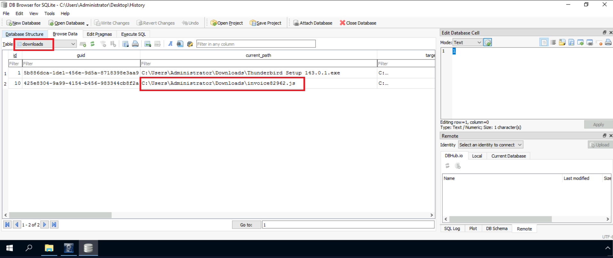

#### Question 2: The malicious JavaScript payload was hosted on a compromised website to facilitate the initial infection. What is the complete domain name that hosted the malicious JS file?

Checking download_url_chains tab we can determine the domain name that hosted the malicious JS file

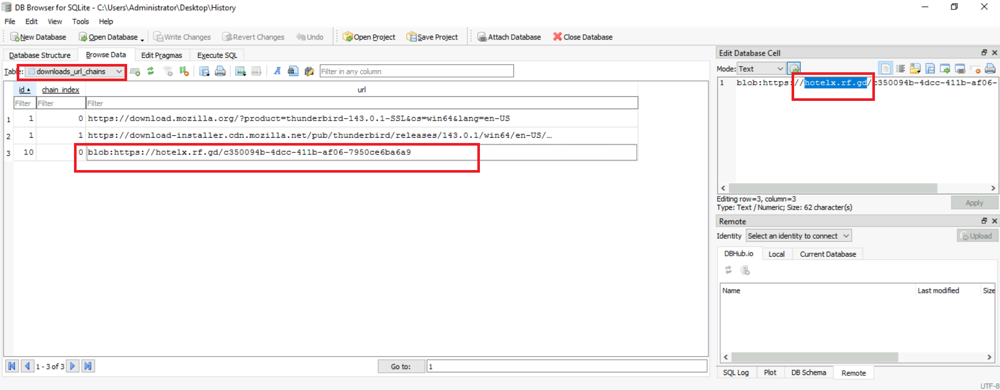

#### Question 3: The JavaScript file created a PowerShell script to advance the attack chain. What is the full directory path where the PowerShell script was created from the JS file?

We determined the JS file is on `C:\\Users\\Administrator\\Downloads\\invoice82962.js` from the solution Question 1. It still exists.

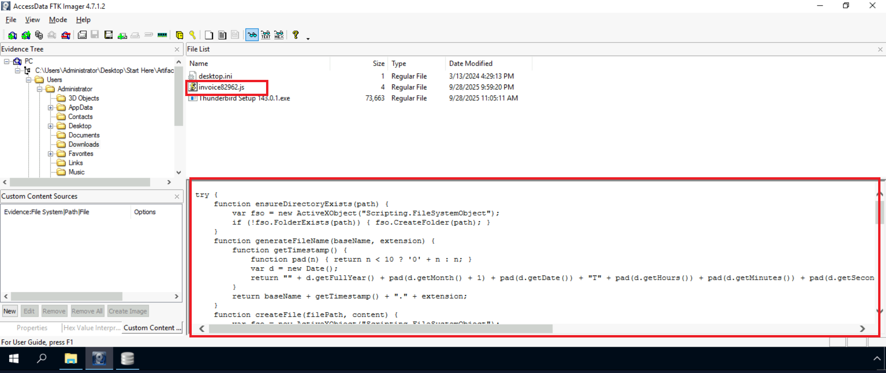

Read it and we can specify the answer

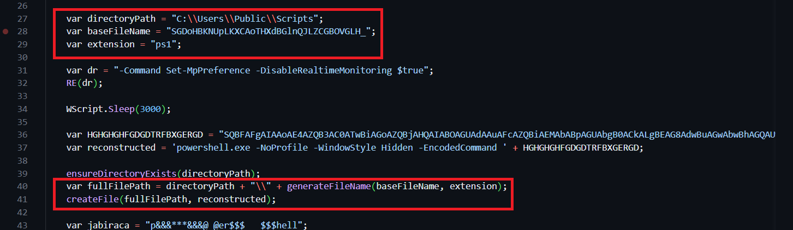

#### Question 4: The PowerShell script invoked another PowerShell command to download two additional files onto the device and then executed one of them. What are the names of the downloaded files?

We can find them by using Sysmon log event 11 (File Creation). Before that I determine the time file `.js` was run. I filter Sysmon event 1 and contain strings "invoice82962.js" and "WScript" (Because of the end of the JS payload, we know that the PowerShell code is executed using WScript)

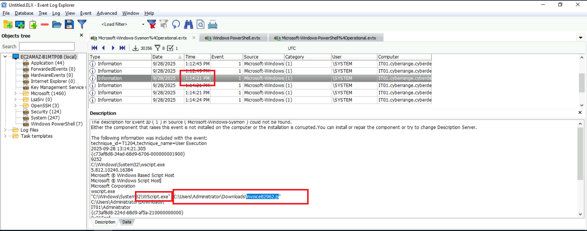

Continue filter event 11 and we can get the answer

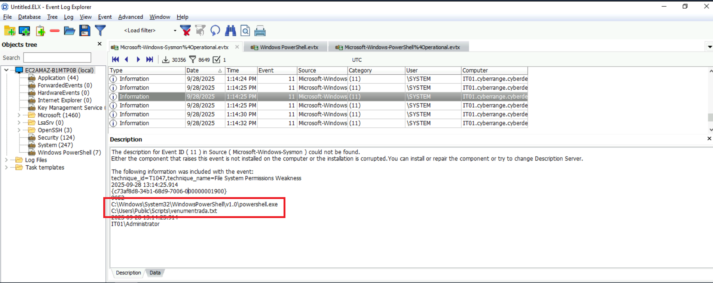

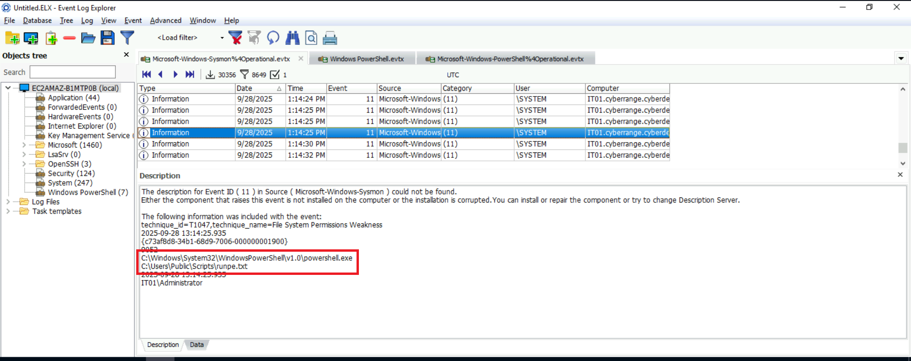

#### Question 5: The downloaded files included obfuscated content that needed to be converted to reveal their true nature. What is the actual file type of the second downloaded file?

We know the location of the two downloaded files: `C:\\Users\\Public\\Scripts`. Load the 2nd file `runpe.txt` to HxD, I saw that it encoded, copy the initial data segment and try to decode to know the magic code -> file type. 

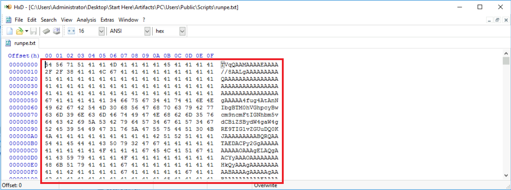

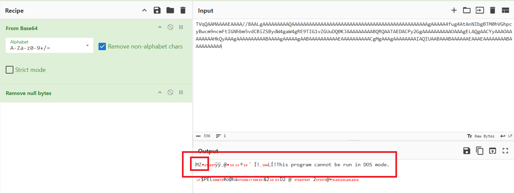

#### Question 6: The first downloaded file converted the second file to its original format, saved it, and then executed it. What is the name of the executed file that was run after conversion?

We can continue using Sysmon 11 events; after the `runpe.txt` event occurs, an event file `.exe` be created.

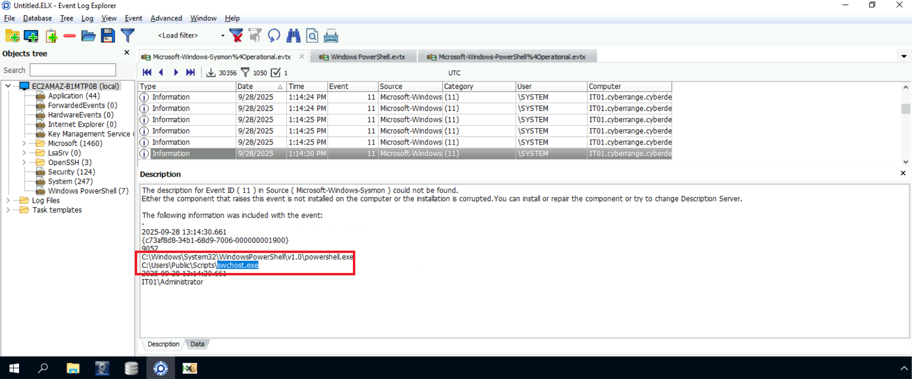

#### Question 7: The initial JavaScript file employed specific technique to evade security controls and prevent detection. What is the MITRE ATT&CK technique ID for the method used by the JavaScript file?

In the JS file, there is a payload Disable Realtime Monitoring. This is Defense Evasion technique -> `T1562.001`

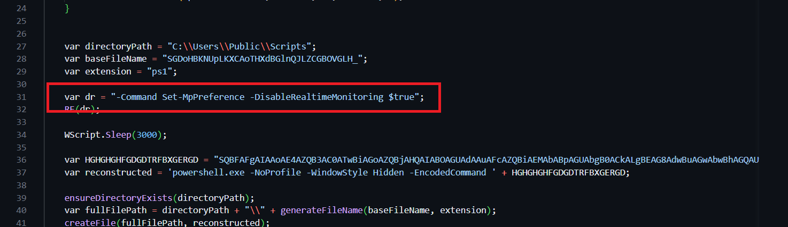

#### Question 8: The malicious executable modified multiple security-related registry keys to weaken system defenses. How many registry keys were edited by the malicious executable?

Filter Sysmon event 13, we can see that there are 12 events related to Windows Defender

#### Question 9: The malicious executable established communication with a C2 server infrastructure. What is the IP address of the C2 server that the malicious executable contacted?

We know the name of malicious executable file is `swchost.exe`. Fitler Sysmon event 3 and that name. We can specify the answer

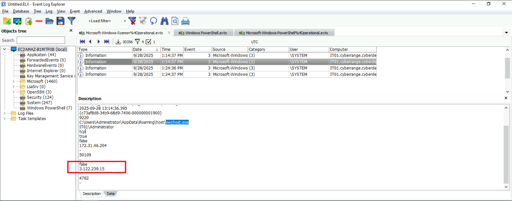

#### Question 10: As part of its persistence strategy, the malware created a copy of itself in a different location. What is the full path where the malware copied itself?

Filter Sysmon event 11 (FileCreate) and the name `swchost.exe`

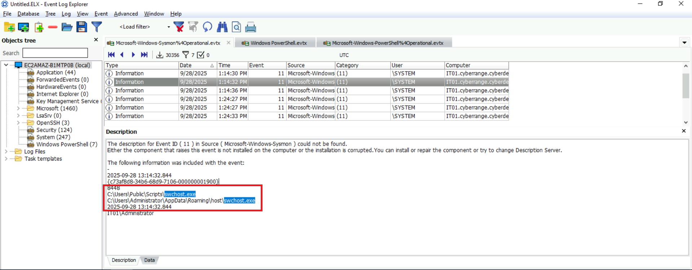

#### Question 11: To maintain persistence after system reboots, the executable added an entry to a specific registry location. What is the full path of the registry key where the executable added its persistence mechanism?

Filter Sysmon event 13 (RegistryEvent (Value Set)) and the name `swchost.exe`

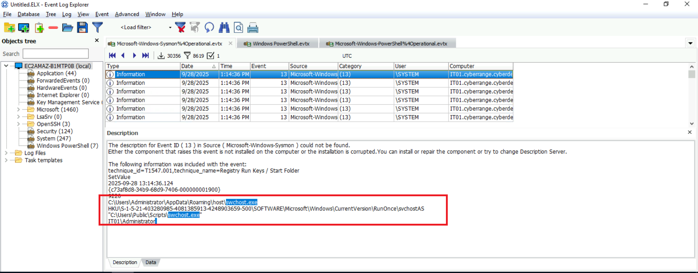

#### Question 12: A VBS script was deployed as an additional persistence mechanism to maintain the malware's presence. What is the name of the VBS script executed by the malicious executable for persistence?

On the output of Sysmon event 11 (FileCreate) with the name `swchost.exe`, there is another file `.vbs` was created and that is `KOoNLZeCGlnQ.vbs`

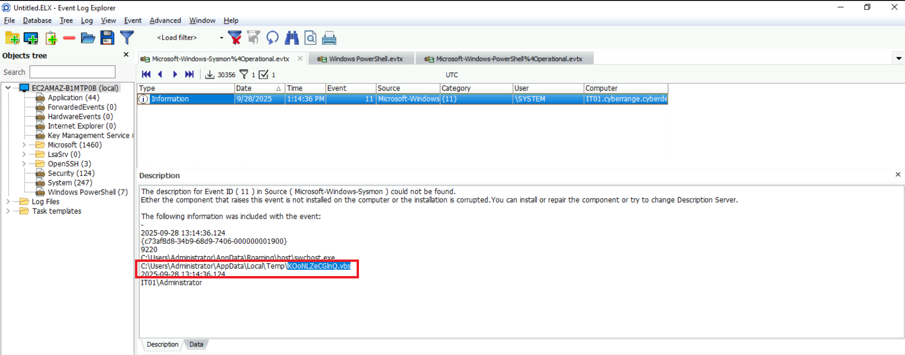
 
#### Question 13: To ensure the malware process couldn't be terminated easily, it used a specific Windows API function to mark itself as critical. What Windows API function does the malicious executable use to mark its process as critical to the system?

By searching Google, I know the Windows API function commonly used by malware to mark its process as critical, making it impossible to terminate without causing a Blue Screen of Death (BSOD), is `RtlSetProcessIsCritical`. Check the hash of `swchost.exe` on Virustotal, I know that this malware use .NET framework so I can use dnSpy or IlSpy to decompile it. After that I search `RtlSetProcessIsCritical` and it exist on this malware -> Prove malicious executable use it

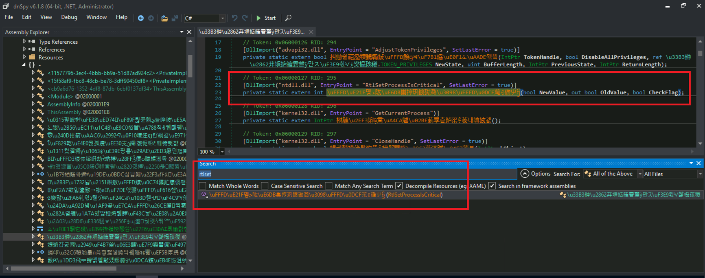

#### Question 14: The threat actor deployed an additional executable specifically designed for data collection activities. What is the name of the executable dropped for data collection purposes?

Continue use Sysmon event 11

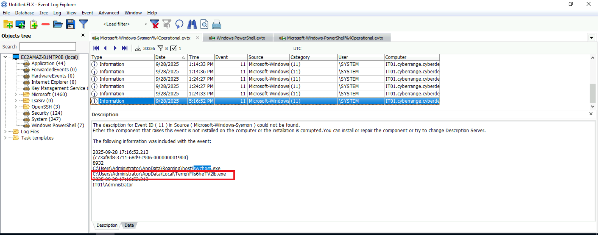

#### Question 15: After gathering sensitive data, the malware compressed the collected information into an archive for exfiltration. What is the exact timestamp when the collected data archive was created? (in 24-hour format)

Searching the name in previous question on Sysmon log. There are many event related to collecting information (One of that is using `FileCollector.dll` -> Prove malware start collecting data) and after that there is a event 11 which a file `data.zip` was created by the malicious process

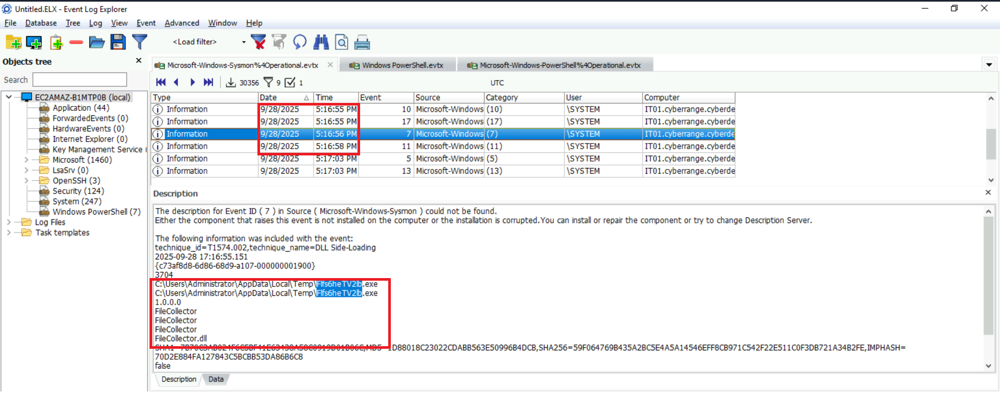

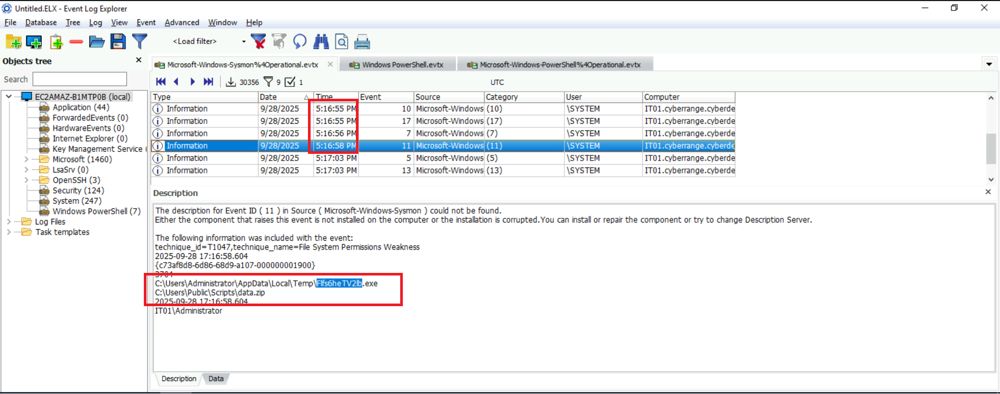

### Final Answer

| Question | Answer |
|---|----|
| Question 1 | `invoice82962.js` | 
| Question 2 | `hotelx.rf.gd` | 
| Question 3 | `C:\Users\Public\Scripts` |
| Question 4 | `venumentrada.txt, runpe.txt` |
| Question 5 | `exe`|
| Question 6 | `swchost.exe` |
| Question 7 | `T1562.001` |
| Question 8 | `12` |
| Question 9 | `3.122.239.15` |
| Question 10 | `C:\Users\Administrator\AppData\Roaming\host\swchost.exe` |
| Question 11 | `SOFTWARE\Microsoft\Windows\CurrentVersion\RunOnce\svchostAS` | 
| Question 12 | `KOoNLZeCGlnQ.vbs` | 
| Question 13 | `RtlSetProcessIsCritical` | 
| Question 14 | `Flfs6heTV2lb.exe` | 
| Question 15 | `2025-09-28 17:16` | 
