# Silent Breach Lab

### Scenario

The IMF is hit by a cyber attack compromising sensitive data. Luther sends Ethan to retrieve crucial information from a compromised server. Despite warnings, Ethan downloads the intel, which later becomes unreadable. To recover it, he creates a forensic image and asks Benji for help in decoding the files.

Resources: [Windows Mail Artifacts: Microsoft HxStore.hxd (email) Research](https://boncaldoforensics.wordpress.com/2018/12/09/microsoft-hxstore-hxd-email-research/)

### Tool

- FTK Imager

- SQLite DB

- DetectItEasy

- pkg unpacker

- `strings`

- CyberChef

### Solution

#### Question 1: What is the MD5 hash of the potentially malicious EXE file the user downloaded?

Load `.ad1` file on FTK Imager, the malicious EXE is in folder `/Download`. This malicious file using technique which is called **double extension spoofing**. On systems like Windows, if file extensions for known file types are hidden (which is often the default), the file may appear simply as `IMF-Info.pdf`. This can trick users into thinking it's a harmless PDF document, when in reality it's an executable (.exe) file that could run malicious code.

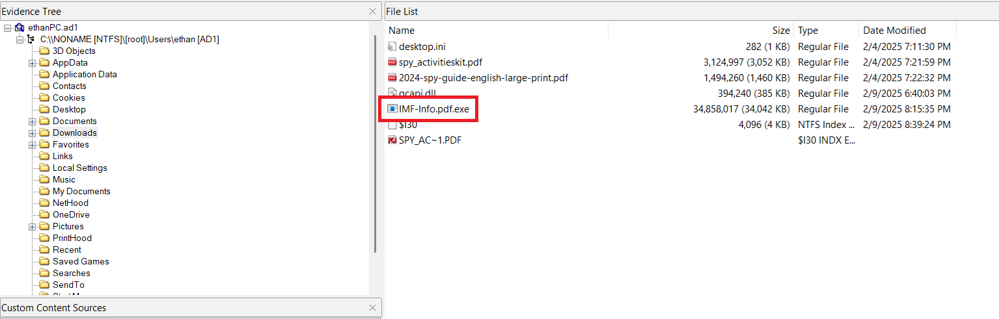

Check the MD5 hash, we will get the answer

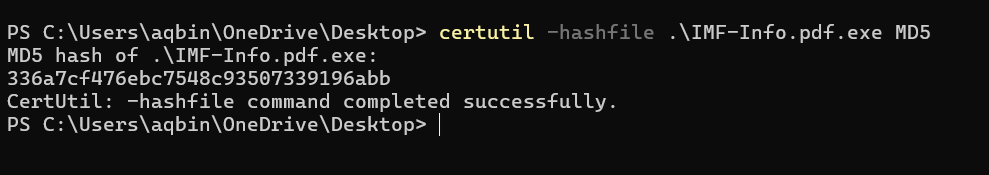

#### Question 2: What is the URL from which the file was downloaded?

To know where the malicious file is downloaded, we have to check the `History` database file of browser. In this lab, there are 2 browsers, the `History` is in:

- Google Chrome: `\AppData\Google\Chrome\User Data\Default\History`

- Microsoft Edge: `\AppData\Microsoft\Edge\User Data\Default\History`

I extracted it and load it on SQLite DB Browser. When I check, in the table `download`, the malicious file is appear

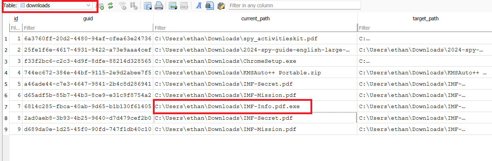

So we know the malicious EXE file is downloaded from `Microsoft Edge` browser. We can find the URL source in `downloads_url_chains` table

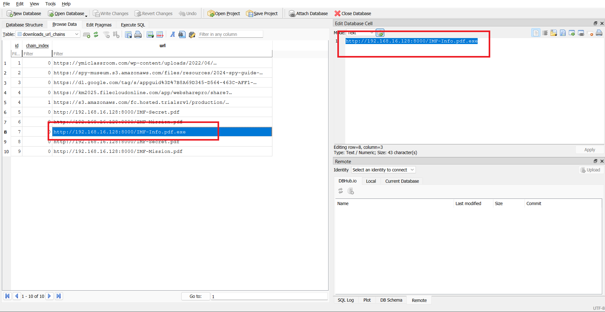

#### Question 3: What application did the user use to download this file?

As explanation on question 2. The malicious EXE file is downloaded from `Microsoft Edge` browser because we find the downloading process on `History` database of `Microsoft Edge`

#### Question 4: By examining Windows Mail artifacts, we found an email address mentioning three IP addresses of servers that are at risk or compromised. What are the IP addresses?

With hint Resource on Scenario of this lab: [Windows Mail Artifacts: Microsoft HxStore.hxd (email) Research](https://boncaldoforensics.wordpress.com/2018/12/09/microsoft-hxstore-hxd-email-research/). We can find the `Windows Mail Artifacts` at `\AppData\Local\Packages\microsoft.windowscommunicationsapps_8wekyb3d8bbwe\LocalState\`.

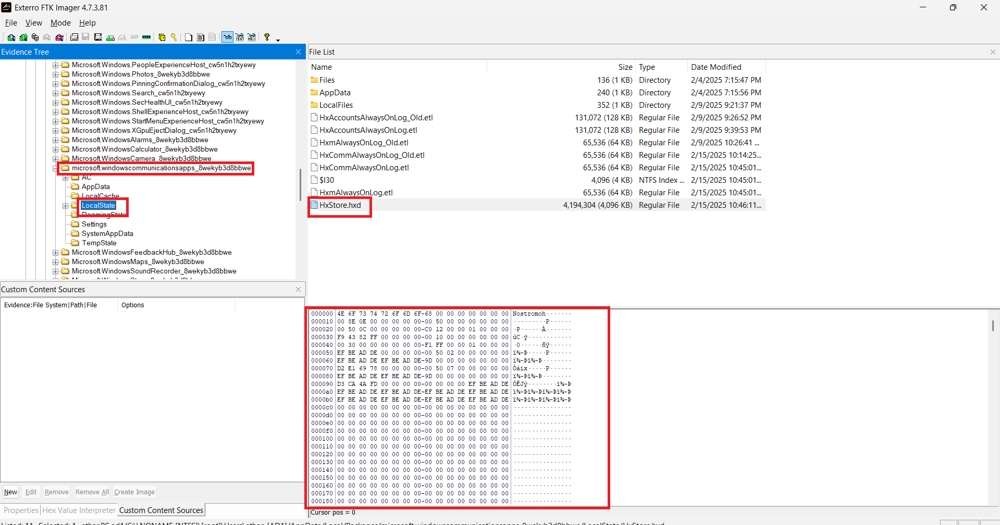

The message in this file is readable and we have to find the IP so I used `strings` to extract the readable data. Moreover, I used regex to find the IP address easier: `\b(?:\d{1,3}\.){3}\d{1,3}\b`

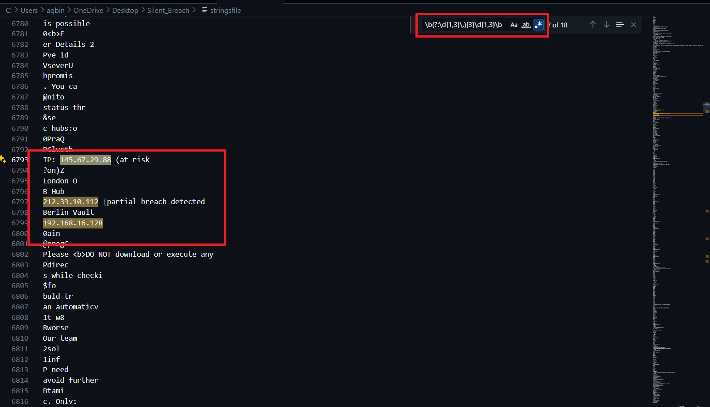

#### Question 5: By examining the malicious executable, we found that it uses an obfuscated script to decrypt specific files. What predefined password does the script use for encryption?

I will export the malicious file to my computer to analyst it. First, I checked it on `DetectItEasy`.

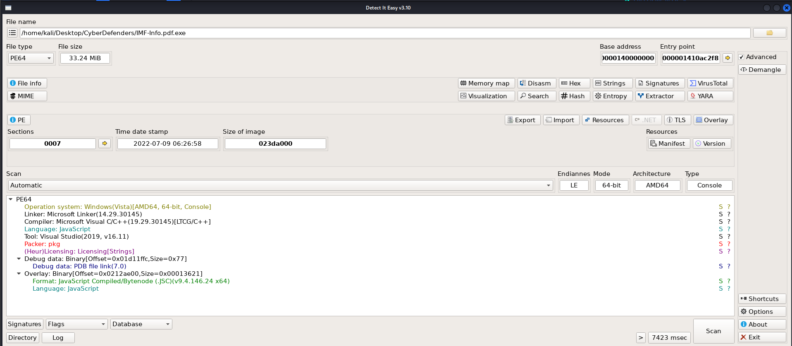

We see that, it's `js` code and was packed by `pkg`. I will use [pkg unpacker](https://github.com/LockBlock-dev/pkg-unpacker) to unpack it

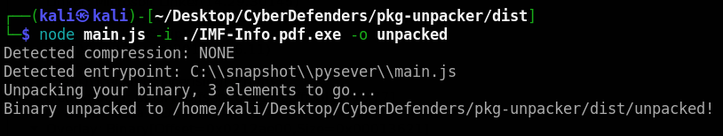

After unpack it, there is a `main.js` file. I cannot open it in Visual Studio Code (maybe there are binary data inside) so I used `strings` to read the readable data inside.

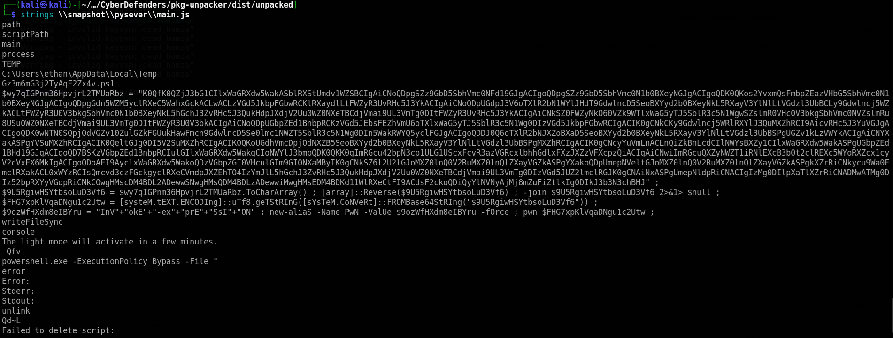

We see that there is a `powershell` code, so I run it in my own Powershell to analyst it fast.

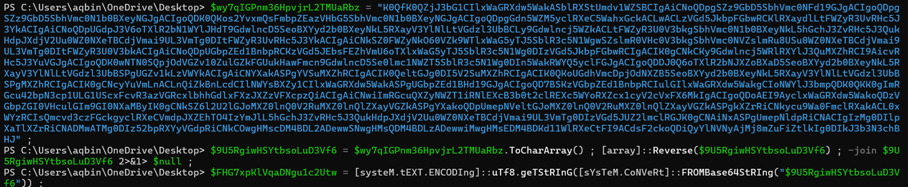

And we have the output and got the answer

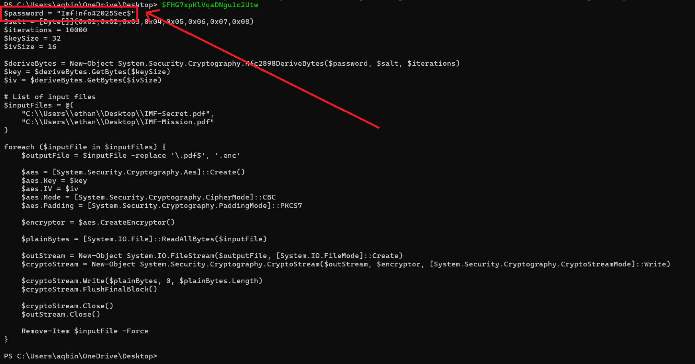

#### Question 6: After identifying how the script works, decrypt the files and submit the secret string

In general, this code encrypts 2 `.pdf` files and returns 2 `.enc` files as output. 2 encrypted files is in `C:\Users\ethan\Desktop\`

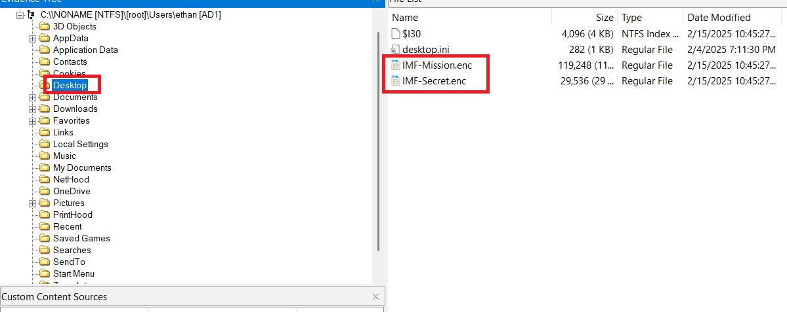

This encryption is using AES, I will run the generating `iv` and `key` process to find it.

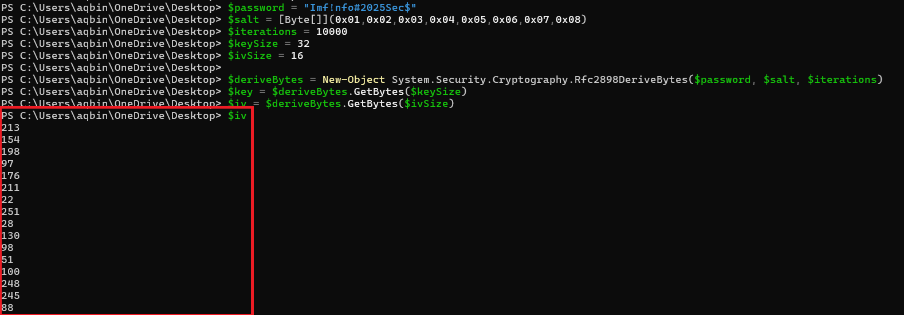

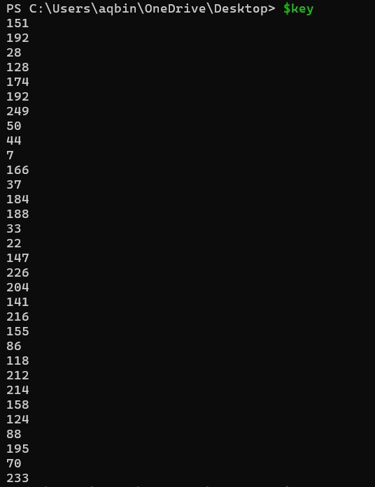

Turn it into hex string for easy use on `Cyberchef`

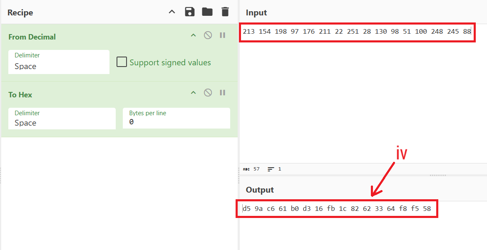

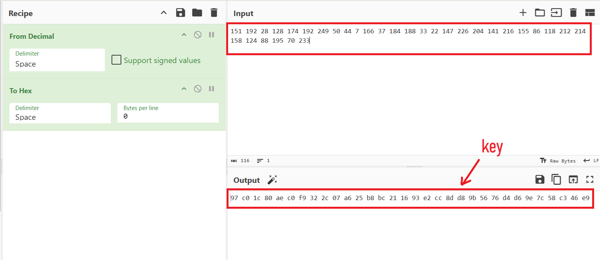

- iv: `d5 9a c6 61 b0 d3 16 fb 1c 82 62 33 64 f8 f5 58`

- key: `97 c0 1c 80 ae c0 f9 32 2c 07 a6 25 b8 bc 21 16 93 e2 cc 8d d8 9b 56 76 d4 d6 9e 7c 58 c3 46 e9`

- input: pdf file

We can find the flag in the output of decryption `IMF-Mission.enc`

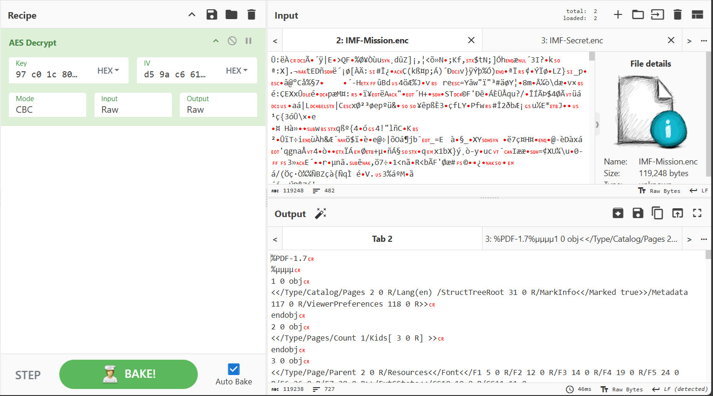

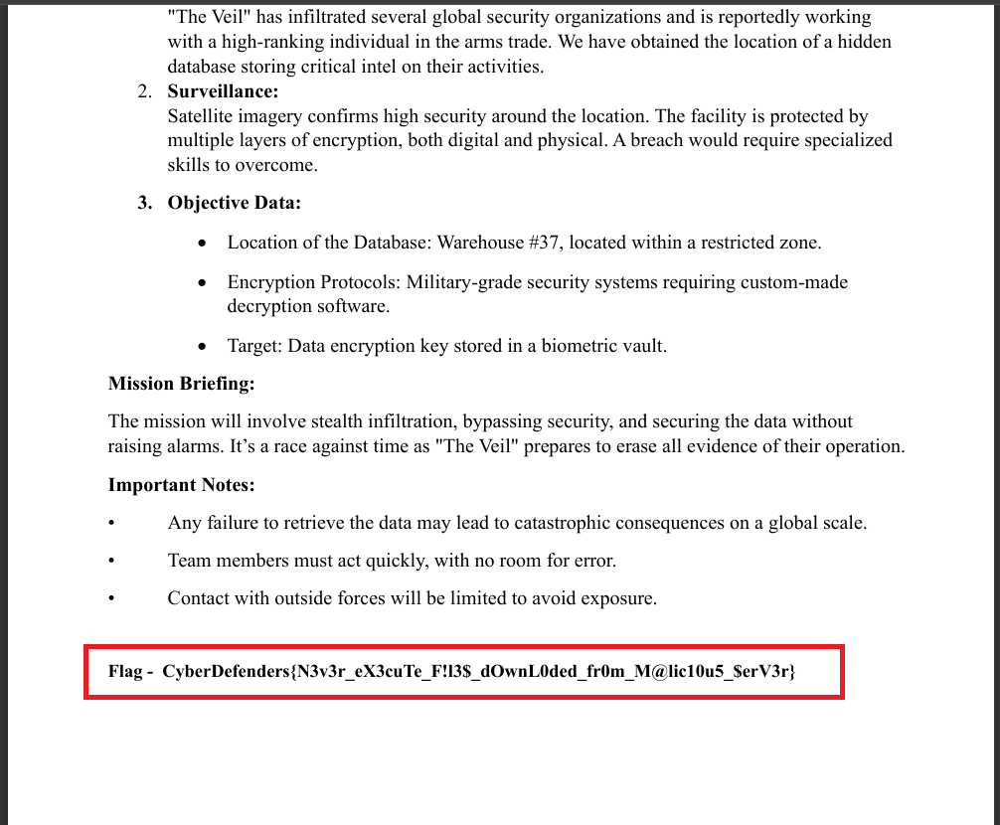

### Final Answer

| Question | Answer |
|---|----|
| Question 1 | `336A7CF476EBC7548C93507339196ABB` | 
| Question 2 | `http://192.168.16.128:8000/IMF-Info.pdf.exe` | 
| Question 3 | `Microsoft Edge` |
| Question 4 | `145.67.29.88, 212.33.10.112, 192.168.16.128` |
| Question 5 | `Imf!nfo#2025Sec$`|
| Question 6 | `CyberDefenders{N3v3r_eX3cuTe_F!l3$_dOwnL0ded_fr0m_M@lic10u5_$erV3r}` |

